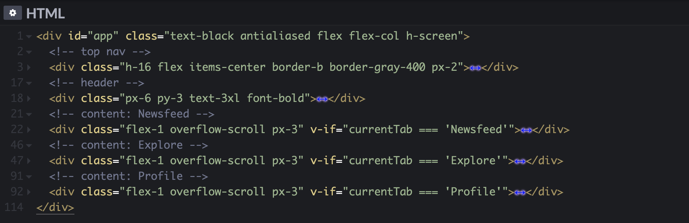

# Conditional rendering


If you are creating a prototype with multiple pages or views you need to include all of them in your `.html` file. Each view will have its own container and proper placement in layout, but showing all views at the same time wouldn't make sense. With Vue.js you can specify conditions that must be satisfied for a container to be shown. This is called **conditional rendering** and it's done with `v-if` directive.

## Equality

Let's say you are creating a prototype with 3 tabs, and you want to allow users to switch between tabs with controls at the bottom:

<video width="100%" controls muted class="">
  <source src="./media/cond-tabs-1.mp4" type="video/mp4">
</video>

Let’s break down the layout of your prototype first. You start with creating 5 main containers:

- Top control bar that shows the title of the current view.
- Content for Newsfeed view
- Content for Explore view
- Content for Profile view
- Bottom tab bar with controls to switch between views.

As a result you will have a layout with 2 bars and 3 content areas all visible at the same time:

<video width="100%" controls muted class="">
  <source src="./media/cond-tabs-2.mp4" type="video/mp4">
</video>

To display each content container when the corresponding tab is selected you need to complete three steps:

1. Create a variable to store the state of the selected tab.
2. Add click event listeners to tab controls to enable changing the value of the variable.
3. Add `v-if` directive to content containers that shows or hides the containers based on the value of the variable.

Let's go through steps one by one.

#### 1. A variable

Make sure the name of the variable suggests that it is used to store the state of the selected tab—this helps you to find it in the layout. Using string data type allows to make the value meaningful too:

```js
data: {
  currentTab: 'Newsfeed'
}
```

#### 2. Event listeners

As explored in [Click article](./../Events/), you can add an event listener that assigns a different value to the variable when a click is detected:

```html
<div @click="currentTab = 'Newsfeed'">Newsfeed</div>
<div @click="currentTab = 'Explore'">Explore</div>
<div @click="currentTab = 'Profile'">Profile</div>
```

You will still see all three content containers in your layout, but now you can use `currentTab` as a title by [rendering](./../Data/display.html#text) its value in the top bar:

```html
<div>{{currentTab}}</div>
```

<video width="100%" controls muted class="">
  <source src="./media/cond-tabs-2.mp4" type="video/mp4">
</video>

#### 3. Conditions

The final step is to use the value of the variable as a condition for rendering content containers. You do this by adding `v-if` directive with conditions to the containers:

```html
<div v-if="currentTab === 'Newsfeed'">
  <!-- Newsfeed content -->
</div>
<div v-if="currentTab === 'Explore'">
  <!-- Explore content -->
</div>
<div v-if="currentTab === 'Profile'">
  <!-- Profile content -->
</div>
```

The syntax of the first container for example can be read as: show the container only if the value of `currentTab` equals to `'Newsfeed'`.

`===` is a Boolean operator that compares the value on the left with the value on the right and returns `true` if they are equal, and `false` if they are not. `v-if` renders the container it’s applied to only if the condition is `true`. 

In the first step you specified the default value of `currentTab` to be `'Newsfeed'`. As a result the first content container is shown by default because its condition inside `v-if` is met. In the second step you added event listeners that change the value of the variable, so when users click on Explore tab for example, the value of `currentTab` is changed to `'Explore'`. When this happens the first container is hidden because its condition is not met any more, and the second container is shown since its condition is satisfied now:

<video width="100%" controls muted class="">
  <source src="./media/cond-tabs-1.mp4" type="video/mp4">
</video>

[Conditional styles](./styles.md) article revisits this prototype and explains how you can highlight a selected element in the bottom tab bar.

## Self-practice

### Task 1:

Create a simple color pallete with an ability to select a color and see its Hex code:

<video width="100%" controls muted loop class="">
  <source src="./media/cond-practice-1.mp4" type="video/mp4">
</video>

1. Create a variable to store the state of the selected color.
2. Create colored buttons that change the value of the variable on click.
3. Create colored containers with Hex values inside. Start with two or three of them.
4. Apply `v-if` to the colored containers so they each of them is rendered only if a particular value is assigned to the variable.

If you have problems with steps 1–3, download the [starting file](./../../../course-files/interaction-basics/conditionals/cond-rend-practice-1-start.html.zip). It inludes the layout, the variable and the event listeners. Complete step 4 and try adding more color options to the palette.

If you have problems completing the task download the [final result](./../../../course-files/interaction-basics/conditionals/cond-rend-practice-1-end.html.zip).

### Task 2:

Recreate the full prototype from this article:

<video width="100%" controls muted class="">
  <source src="./media/cond-tabs-1.mp4" type="video/mp4">
</video>

1. Download the [starting file](./../../../course-files/interaction-basics/conditionals/cond-rend-practice-2-end.html.zip), open in it VSCode and study the layout.
2. To navigate around the code faster collapse main containers, and remember to keep them collapsed when you are not working with their contents:  

3. Follow the steps descirbed in the article: [create a variable](./#_1-a-variable), [add event listeners](./#_2-event-listeners) and finally [add `v-if` to content containers](./#_3-conditions).

If you have problems completing the task download the [final result](./../../../course-files/interaction-basics/conditionals/cond-rend-practice-2-end.html.zip).

<!-- :::tip Note
Using 3 equal signs to check for equality may look like an overkill, but single equal sign is responsible for [assigning values](./../Events/#assigning-a-value), and two equal signs just don't look fancy enough (and may lead to some unexpected behavior).
::: -->

<!-- To store the information about the selected tab you need to create a variable

A variable that stores the state is no different from any other vairables -->


<!-- ### Event listeners -->

<!-- Each of the content containers should be displayed only when the corresponding tab is selected. To achieve this you start with creating a variable to store the state of the selected tab and adding `@click` event listeners to tab controls to change the value of the variable: -->


<!-- The 3 content containers souldn't be displayed at the same time, but 

To make a container appear conditionally you start with creating a variable you will base your decision on. 

so for each of them you will provide conditions.  -->


<!-- With Vue.js you can specify conditions for containers that have to be  -->

<!-- You can control ... with `v-if` attribute and conditions  -->

<!-- If you are creating a prototype with multiple views you need an ability to switch between views. -->