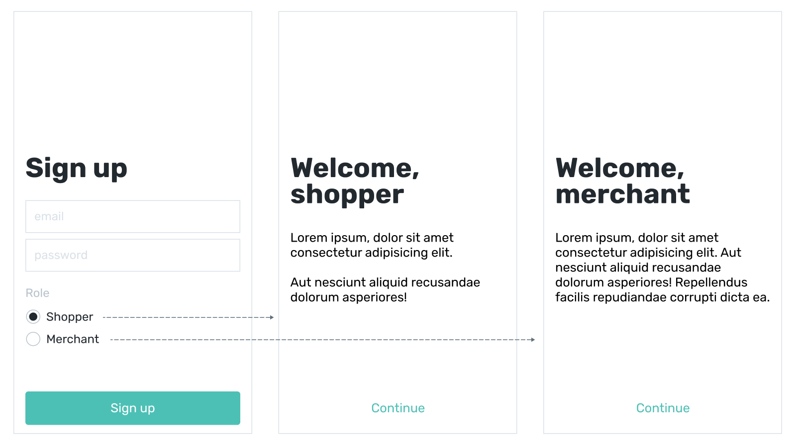
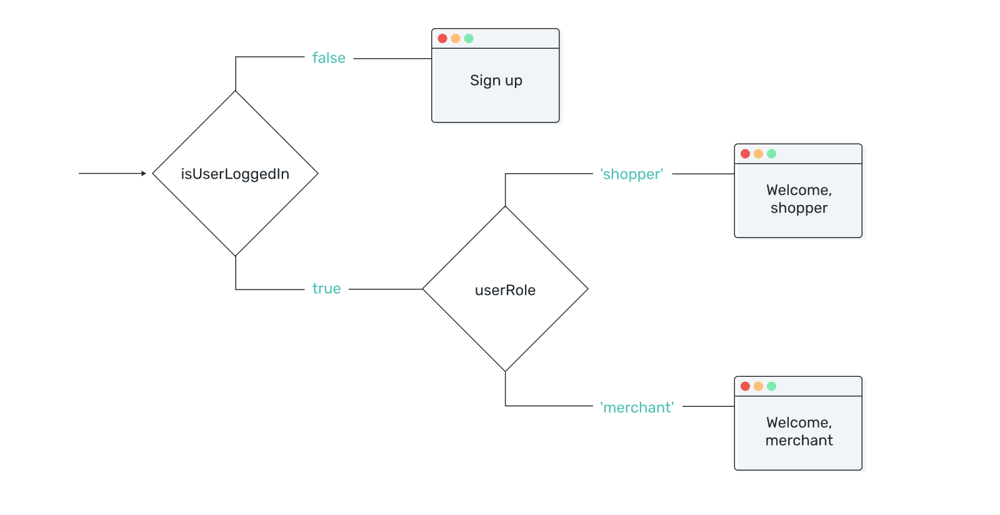
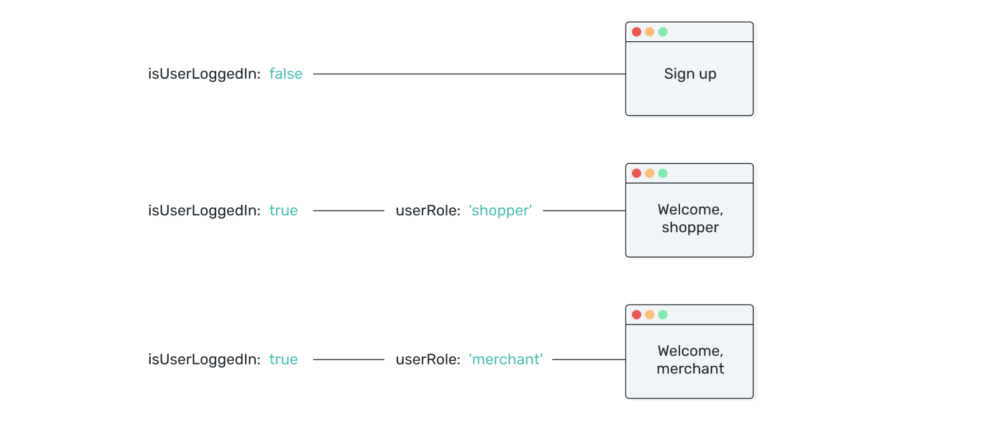
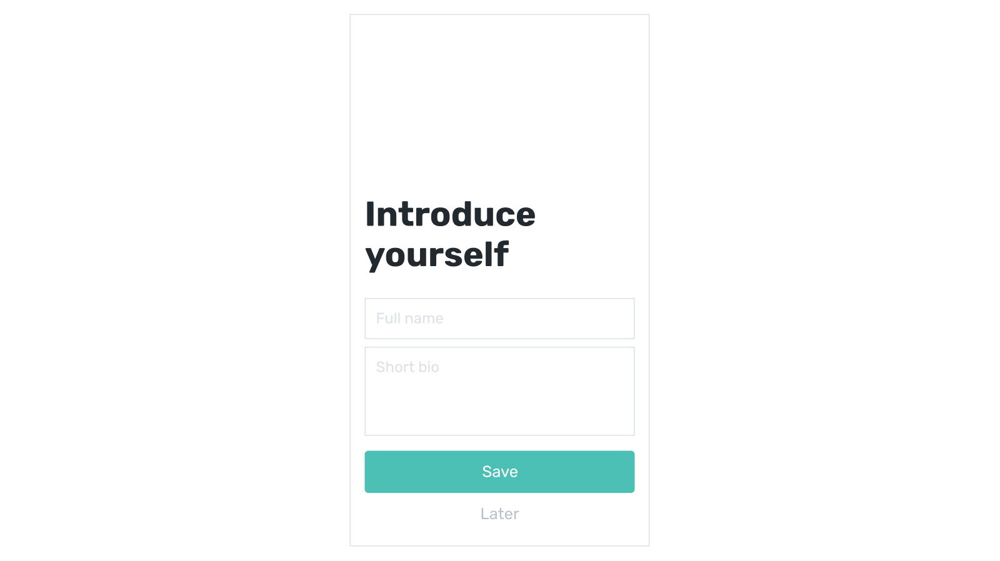

# Complex conditions

## Multiple conditions — AND

Quite often checking for a single condition is not enough. Let's say your prototype has two kinds of welcome screens — each for a role users choose when signing up:



Here's a rough userflow for this case:



First, you check whether users are logged in. If they are, you check for their role to show one welcome screen to shoppers and another one to merchants. You can implement this by creating two variables and two layers of conditional containers:

```vue
<div v-if="!isUserLoggedIn">
  Sign up screen
</div>
<div v-if="isUserLoggedIn">
  <div v-if="userRole === 'shopper'">
    Welcome, shopper
  </div>
  <div v-if="userRole === 'merchant'">
    Welcome, merchant
  </div>
</div>
```
<!-- ```js
data: {
  isUserLoggedIn: false,
  userRole: 'shopper'
}
``` -->

This works fine, but you can avoid nesting containers by combining conditions. When you turn the flowchart into a flat list of conditions for each screen, it's easy to see which conditions should be combined for each container:



You can combine two conditions, that **both** have to be satisfied, with **AND** operator written as **&&:**

<!-- In our example you need to check whether two conditions are satisfied for welcome screens, use AND written as &&: -->

```html
<div v-if="isUserLoggedIn">
  Sign up
</div>
<div v-if="isUserLoggedIn && userRole === 'shopper'">
  Welcome, shopper
</div>
<div v-if="isUserLoggedIn && userRole === 'merchant'">
  Welcome, merchant
</div>
```
#### 👐 Hands-on

1. Download the [sample file](./../../../course-files/interaction-basics/conditionals-complex-and-1.html.zip) and open it in Chrome.
2. Use radio buttons on Sign up screen to switch roles. See value changing in dev tools.
3. Switch authentication state between `true` and `false` in Vue dev tools to see different welcome screens.

<video width="100%" controls loop autoplay muted>
  <source src="./images/conditions-complex-1.mp4" type="video/mp4">
</video>

## Either of conditions — OR

<!-- Another case of conditional rendering you'll meet when prototyping is when there are two or more conditions required to display an element, and you need just one of them, not all. Below is the example of onboarding with 3 pages: -->

<!-- There's another case that requires to use two conditions — when  -->

In some cases you want an element to be rendered if **either** of two conditions is met, not both of them. Take a look at a very basic onboarding with pagination:



Notice that “Next” button, for example, appears on the first and the second screens. So the condition to display this button would be if the current page is first or second. To perform this type of check use **OR** operator written as **||**:

```html
<button v-if="currentPage === 1 || currentPage === 2">
  Next
</button>
```

This condition can be read as “show the container if `currentPage` equals to 1 OR if `currentPage` equals to 2”. Now when either of those conditions is satisfied, the container will be rendered. 

#### 👐 Hands-on

1. Download the [sample file](./../../../course-files/interaction-basics/conditionals-complex-or-1.html.zip) and open it in Chrome.
2. Select Root in devtools and click - / + in to change the value of currentPage and see the appropriate containers being shown and hidden.
3. Open the file in VSCode and see the structure used to achieve the result. 

<video width="100%" controls loop autoplay muted>
  <source src="./images/conditions-complex-2.mp4" type="video/mp4">
</video>

## Combining conditions

Conditions for rendering UI elements can become quite complex and rely on more than two variables. For example, you have a universal navigation bar in your application. You need a button that is shown only to users from either Admin or Super-admin groups and only on Users screen:


You can combine as many conditions as you want, but you need to keep in mind that different operators have different [precedence](https://developer.mozilla.org/en-US/docs/Web/JavaScript/Reference/Operators/Operator_Precedence#Table). For example this code will not produce the expected results:

<!-- This means that your conditions won't be read by browser simply from left to right, but checking for equality, for example, will be performed before OR operators. This code will not produce expected results: -->

```html
<button v-if="role === 'admin' || role === 'superadmin' && screen === 'users'">
  Add
</button>
```

Since AND operator has higher precedence than OR, for admins the button will be rendered on all screens: `userRole === 'superadmin' && currentScreen === 'users'` will be executed first and result in false, then `userRole === 'admin' || false` will result in true no matter what value currentScreen has.
 <!-- `userRole === 'superadmin' && currentScreen === 'users'` will be executed first and the button will be rendered for admins on all screens. -->

You can use **parenthasis** to control the order of operations, because groupping has the highest precedence and an operation inside group will be always performed first. 

```html
<button v-if="(role === 'admin' || role === 'superadmin') && screen === 'users'">
  Add
</button>
```

## 👶 Self-practice: basic