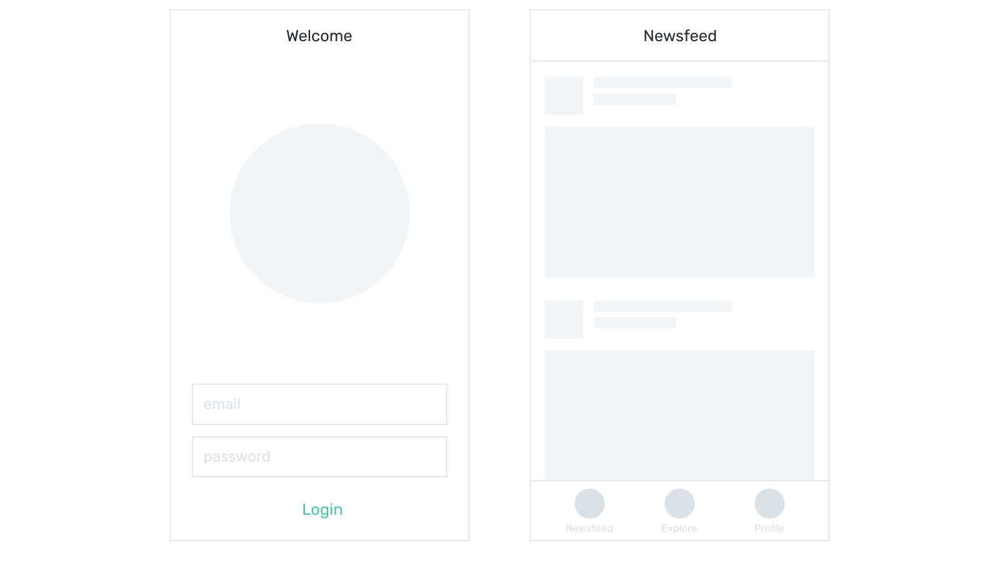

# Hiding containers

## v-if

Let's say you are creating a prototype with two views:



The task is as simple as showing the Welcome view if users are not authenticated, and showing the Newsfeed if they are. So you need to have both layouts in your prototype, but only one of them is shown at a time.

To make a container appear conditionally you start with creating a variable you will base your decision on. In the example above the condition is the state of authentication. It is binary — a user is either logged in or is not. This is where Boolean variables, being binary by nature, come in handy:

```js 
data: {
	isUserLoggedIn: false,
}
```

Now all you have to do is to make a container conditional by adding `v-if` attribute:

```html
<div v-if="isUserLoggedIn">
	<!-- Dashboard view content -->
</div>
```

`v-if` attribute can be read as “display the container only if the following condition is true”. Since the default value for `isUserLoggedIn` is `false` the container will not be shown in a browser.

To test this, download the [file](https://firebasestorage.googleapis.com/v0/b/mockupless.appspot.com/o/conditions%2Fvif-1.html.zip?alt=media&token=78d7fa52-6c9c-46cd-bd40-e432507ff13c), open it in Chrome, and enjoy the blank screen. Now open the Vue section in Chrome developer tools, find the `isUserLoggedIn` variable, double-click on its value and change it to `true`. The word “Dashboard” should appear on the page.


#### Hands-on

Open the same file in VSCode and change the name of the variable from `isUserLoggedIn` to `doShowNewsfeed` and change the default value to `true`. Test it in browser. You should see the word Dashboard on screen. If you don't, go back to code and make sure that you've changed the name of the variable in the `v-if` attribute as well.

:::tip Remember
When you change the name of the variable you have to change it everywhere in your code. In VSCode press `command + f` to open Find menu to look for instances. You can also press `command + option + f` to open Replace menu to quickly find and replace all instances.
:::

## ! (not)

Contrarily to the Dashboard's condition, the Login view is shown when the use is *not* authenticated. There's a special operator that allows you to check for a *not* condition. It's conveniently called **not** and it's written as an exclamation mark in front of a variable:

```html
<div v-if="!isUserLoggedIn">
	<!-- Welcome view content -->
</div>
```

The expression above can be read as "Show the container only if the following condition is *not* true". Since being false is the only way of being not true, the container will be shown when the `isUserLoggedIn` has the value of `false`.

:::tip Pro tip
Naming your Boolean variables in a form of a general question helps to quickly identify them as booleans in your code and optimize suggestions provided by VSCode. If you have many conditions defined this way inside `data` container, when you type `v-if="is` or `v-if="do` you will be presented with suggestions of all the variables you designed as conditions, so you will save time finding the right one.
:::

With both containers being conditional your layout should look similar to this:

```html
<div v-if="!isUserLoggedIn">
	<!-- Welcome view content -->
</div>
<div v-if="isUserLoggedIn">
	<!-- Dashboard view content -->
</div>
```

Try it yourself: download the [file](https://firebasestorage.googleapis.com/v0/b/mockupless.appspot.com/o/conditions%2Fvif-2.html.zip?alt=media&token=9f583403-aa54-406f-bae8-eac568ae478b), open it in Chrome and use  Vue devtools to change the value of the variable from `false` to `true` and back. The content you see on a page is supposed to change accordingly:


## Self-practice: basic 

Create a lo-fi prototype of a messaging app with two views — Recent and Chat:


1. Create the Recent page layout.
2. Create a Boolean variable to use as a condition.
3. Add `v-if` to Recent container and use the condition to hide it by default.
4. With Recent view out of your way create Chat layout.
5. Add `v-if` to Chat container and now use the condition to hide Chat by default.
6. Test your prototype by changing the value in Vue devtools in Chrome.

## Self-practice: pro

<!-- todo: split pro task into two: advanced and pro. Advanced has accordion-ish UI: expand/collapse details — v-if on details content and also two arrows: up and down, depending on the state. Pro remains the same but with maybe a more complex UI -->

Conditional rendering is not limited to showing and hiding pages. Quite often smaller containers *within* a view also must be hidden unless some conditions are met.

Practice this by creating a simple subscription form that initially shows only one checkbox, and it's off by default. If the user checks it, show  another 2 checkboxes, as seen on a sketch below:


1. Create a layout with all the containers and the content.
2. Create a variable and connect it to the first checkbox.
3. Use this variable as a condition for a container with other two checkboxes.
4. Test your prototype by checking and unchecking the first checkbox. The other two checkboxes should be shown and hidden as designed.