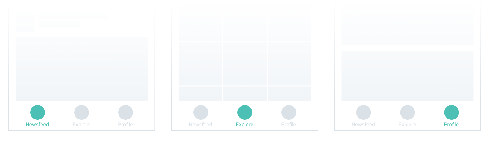
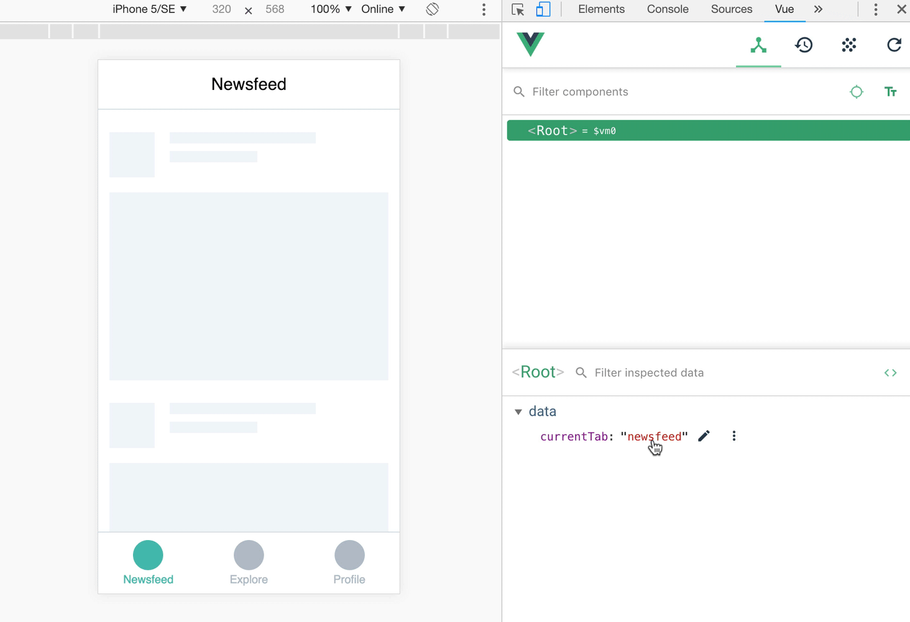
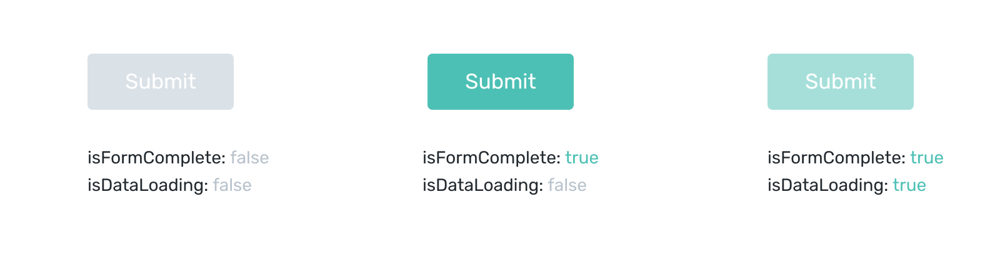
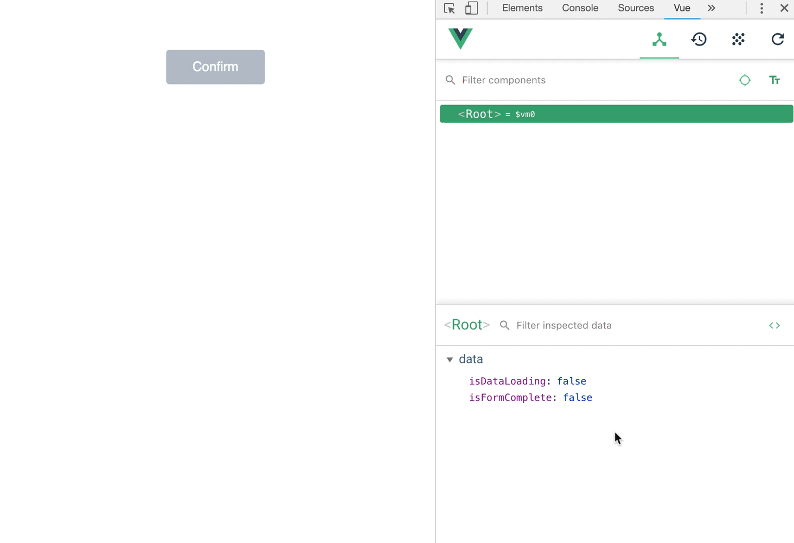

# Conditional styles

## Conditional class

Let's go back to the example from the previous lesson, but this time focus on the tab bar: 



By default icons and labels on tabs are colored in grey. Your task is to change the color of an element to teal when the corresponding tab is selected.

First, create containers and apply default styles. Here's a very simplified version with just one tab and without an icon:

```html
<div class="text-grey">
  Newsfeed
</div>
```

The selected style is conditional because it's applied only to a selected tab. So you need a variable that you will use for checking conditions. As in previous lesson, the condition is the currently selected tab:

```js
data: {
  currentTab: 'newsfeed'
}
``` 

Lastly, you need to add conditional class attribute to the container together with the condition of applying it:

```html
<div class="text-grey" :class="{'text-teal': currentTab === 'newsfeed'}">
  Newsfeed
</div>
```

`:class` attribute can be read as “add this class to the container if the following condition is true”. Since the default value for `currentTab` is `newsfeed` the `text-teal` class will be applied.

:::tip Note
The syntax of `:class` attribute looks complex at first. It *is* complex for sure, but it will make way more sense and hopefully become familiar when you become familiar with Objects. For now, it's easier to read if you break it down into smaller pieces:
- class name is written in single quotes
- a class name and a condition are separated by colon
- the value is surrounded by curly braces
:::

#### 👐 Hands-on

1. Download the [sample file](./../../../course-files/interaction-basics/conditionals-style-1.html.zip) and open it in Chrome.
2. In vue devtools change the value of `currentTab` to `'explore'` and then to `'profile'`.



## Multiple classes

### Single condition

Sometimes you may want to add multiple conditional classes to a container. Let's say that in the example above the selected tab must not only be colored in teal, but also the font must become bold. Just as in regular `class` attribute you separate classes with space:

```html
<div class="text-grey" :class="{'text-teal font-bold': currentTab === 'newsfeed'}">
  Newsfeed
</div>
```

You can add as many classes as you wish with a single condition. Note, that they all are positioned inside the single quotes.

### Multiple conditions

Another common case is to have multiple conditional classes based on different conditions. For example, you have a button that is greyed-out by default. It becomes colored when the form is complete, and it also becomes half-transparent when conversation with server is simulated:



To implement this kind of behavior, you define multiple styles separated by coma, each with its condition:

```html
<div class="bg-grey px-4 py-3 text-white" :class="{'bg-teal': isFormComplete, 'opacity-50': isDataLoading}">
  Submit
</div>
```

#### 👐 Hands-on

1. Download the [sample file](./../../../course-files/interaction-basics/conditionals-style-2.html.zip) and open it in Chrome.
2. In Vue devtools change values of `isDataLoading` and `isFormComplete` to `true`. You can do so by checking the box that appears when hovering a variable — it's a nice shortcut in devtools to change boolean value to the opposite one so you don't have to type in `true` or `false`.



## 🧒 Self-practice: kid

Add two conditional styles to each tab in the given prototype: when the tab is selected, color the bottom border in pink, and when the tab is not selected, lower its opacity to 25%:

> gif

1. Download the [starting file](./../../../course-files/interaction-basics/conditionals-style-task-1-start.html.zip)
2. 
3. 

If you have any problems completing the task, dowload and review the [complete prototype](./../../../course-files/interaction-basics/conditionals-style-task-1-end.html.zip)

## 🦸‍♀️ Self-practice: hero

## 🧝‍♂️ Self-practice: elf
