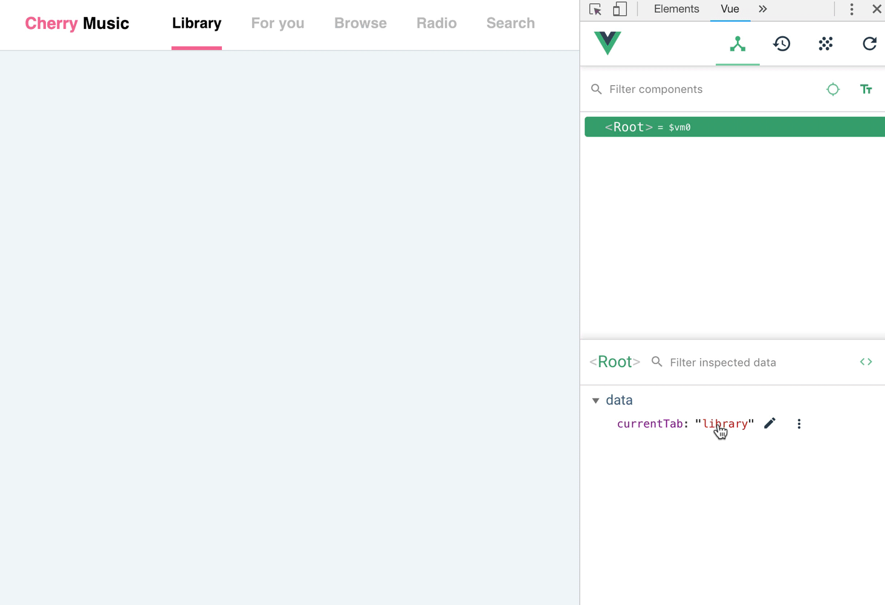

# Conditional styles

## Conditional class

Let's go back to the example from the previous lesson, but this time focus on the tab bar: 


By default tabs' icons and labels are colored in grey. The task is to have the style of elements changed to teal when the corresponding tab is selected.

First, create containers and apply default styles. Here's a very simplified version with just one tab and without an icon:

```html
<div class="text-grey">
  Newsfeed
</div>
```

The selected style is conditional because it's applied only to a selected tab. You need a variable that you will use for checking conditions. As in previous lesson, the condition is the currently selected tab:

```js
data: {
  currentTab: 'newsfeed'
}
``` 

Lastly, you need to add conditional class attribute to the container together with the condition of applying it:

```html
<div class="text-grey" :class="{'text-teal': currentTab === 'newsfeed'}">
  Newsfeed
</div>
```

`:class` attribute can be read as “add this class to the container if the following condition is true”. Since the default value for `currentTab` is `newsfeed` the `text-teal` class will be applied.

:::tip Note
The syntax of `:class` attribute looks complex at first. It *is* complex for sure, but it will make way more sense when you become familiar with Objects, beacuse it is one. For now, it's easier to read if you break it down into smaller pieces:
- class name is written in single quotes
- a class name and a condition are separated by colon
- the value is surrounded by curly braces
:::

#### 👐 Hands-on

1. Download the [sample file](./../../../course-files/interaction-basics/conditionals-style-1.html.zip) and open it in Chrome.
2. In vue devtools change the value of `currentTab` to `'explore'` and then to `'profile'`.
3. Open the file in VSCode and see the structure used to achieve the result. 


## Multiple classes

### Single condition

Sometimes you may want to add multiple conditional classes to a container. Let's say that in the example above the selected tab must not only be colored in teal, but also the font must become bold. Just as in regular `class` attribute you separate classes with space:

```html
<div class="text-grey" :class="{'text-teal font-bold': currentTab === 'newsfeed'}">
  Newsfeed
</div>
```

You can add as many classes as you wish for a single condition, separated by whitespace, inside a pair of single quotes.

### Multiple conditions

Another common case is to have multiple conditional classes based on different conditions. For example, you have a button that is greyed-out by default. It becomes colored when the form is complete, and it also becomes half-transparent when conversation with server is simulated:


To implement this kind of behavior, you define multiple classes separated by coma, each with its condition:

```html
<div class="bg-grey" :class="{'bg-teal': isFormComplete, 'opacity-50': isDataLoading}">
  Submit
</div>
```

#### 👐 Hands-on

1. Download the [sample file](./../../../course-files/interaction-basics/conditionals-style-2.html.zip) and open it in Chrome.
2. In Vue devtools change values of `isDataLoading` and `isFormComplete` to `true`. You can do so by checking the box that appears when hovering a variable — it's a nice shortcut in devtools to change boolean value to the opposite one, so you don't have to type in `true` or `false`.
3. Open the file in VSCode and see the structure used to achieve the result. 


## Self-practice: basic

Take a basic desktop tab bar and add 2 conditional styles to each tab:
- When the tab is selected, color the bottom border in pink
- When the tab is not selected, lower its opacity to 25%



1. Download the [starting file](./../../../course-files/interaction-basics/conditionals-style-task-1-start.html.zip). Preview it in Chrome and open in VSCode.
2. Create a variable to store the state of the currently selected tab, set the default value to `'library'`
3. Add conditional class attribute to Library tab with class `'border-pink'` applied if the tab is selected, and class `'opacity-25'` applied if the tab is not selected.
4. Open the file in browser. Library tab should have pink underline by default. Open the Vue dev tools and try changing the value of the variable to anything else. The tab should become greyed-out. If it doesn't, go back to your code, look for syntax errors and check whether you applied conditional classes to the correct container.
5. Add conditional classes to all tabs with `'border-pink'` class applied when the corresponding tab is selected, and `'opacity-25'` when it is not.
6. Go to browser, reload the page, open Vue dev tools and try changing the value of the variable. Pink underline should jump between selected tabs while others become greyed-out. If they don't, make sure you are entering the values you specified in conditions, and look for syntax errors.

#### Solution
If you have any problems completing the task, dowload and review the [complete prototype](./../../../course-files/interaction-basics/conditionals-style-task-1-end.html.zip)

## Self-practice: pro

Prototype a simple workout checklist. When a user checks out an item its label becomes greyed-out and lined-through:


1. Create a basic layout with shown content and your own styles. 
2. Create a variable for each item. Connect them to checkboxes.
3. Add conditional classes `text-grey` and `line-through` to labels.

:::tip Tip
Don't forget to add `id` attributes with unique values to checkboxes and `for` attributes to labels with corresponding values, to make labels clickable.
:::

#### Solution
If you have any problems completing the task, dowload and review the [complete prototype](./../../../course-files/interaction-basics/conditionals-style-task-2-end.html.zip)
