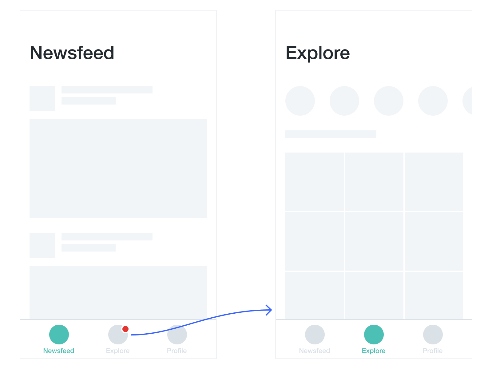
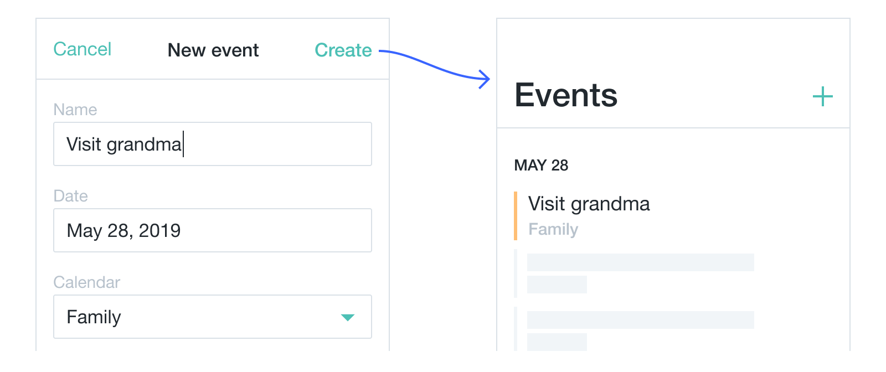

# Storing data

<!-- todo: illustration: storing in containers. Idea: instead of using old-fashioned analogies like construction site, design something more futuristic.  -->

When prototyping interactive experiences you have to decide whether you should place some parts of your content directly into the layout or store it separately as **data**. To make these decisions quickly and efficiently you need to understand *why* you should store some content apart from the layout in the first place. Two main reasons—making content dynamic and saving users' input—are explored in this article.

### Dynamic content

All texts, images and styles you add to your HTML are **hard-coded** by default. This means you cannot change them as soon as the prototype is launched in a browser. But interactivity implies that some things *have* to change when users interact with an interface. Take an example of a user tapping on Explore tab in a basic UI:

A single action requires multiple transformations:

- The title in the header changes from “Newsfeed” to “Explore”.
- The contents of the prototype change entirely.
- The style of the Newsfeed button in the tab bar changes to unselected grey, and Explore becomes selected teal.
- The badge that indicates updates under Explore tab vanishes.

To enable all these transformations you will store selected content and information about states of components separately from layout, together with information provided by users.

### Users' input

With all kinds of form controls available to you in HTML, you may want to save users’ input and use it somewhere in the prototype. For example, a list may be populated with events created by a user:
<!-- todo: link: to Layout basics with form controls -->

The name and the calendar inputs become a list item, and the date is used to create the group header. To prototype this kind of experience you need to save information taken from a user in one view and display it in another one.

There are special containers called **variables** that allow you to store contents, states and users’ input separately from layout to enable updating them when interacting with a prototype. Variables and their data types are explored in the next article. 