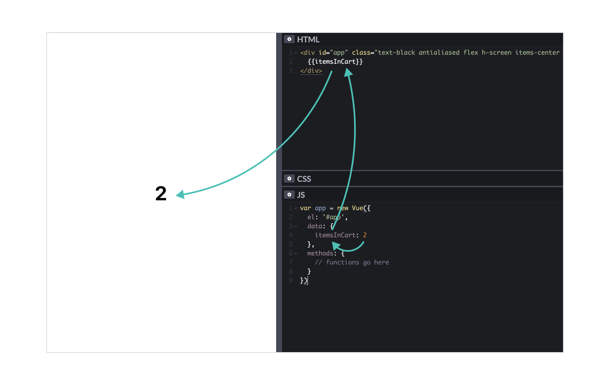

# Displaying data

## Text

Data stored in a variable can be rendered in layout as plain text:



To display a variable’s value you place its name in the layout surrounded by two pairs of curly braces:

```html
<div id="app">
  <div>{{itemsInCart}}</div>
<div>
```
```js
data: {
  itemsInCart: 2
}
```

This syntax indicates that `itemsInCart` is a variable and its value should be rendered. Remember, all dynamic contents must be placed inside the container with `id="app"` found in the [template](./../Setup/).

A variable doesn't have to take up the whole div container. You can put it next to a static text or next to another variable: 

<!--  -->

<iframe height="348" style="width: 100%;" scrolling="no" title="Data—Displaying—Multiple" src="//codepen.io/andgordy/embed/mgmPjV/?height=348&theme-id=36403&default-tab=result" frameborder="no" allowtransparency="true" allowfullscreen="true">
  See the Pen <a href='https://codepen.io/andgordy/pen/mgmPjV/'>Data—Displaying—Multiple</a> by And Gordy
  (<a href='https://codepen.io/andgordy'>@andgordy</a>) on <a href='https://codepen.io'>CodePen</a>.
</iframe>

```html
<div id="app">
  <div>{{firstName}} {{lastName}}</div>
  <div>{{itemsInCart}} pieces</div>
  <div>${{total}}</div>
<div>
```
```js
data: {
  firstName: 'Steve',
  lastName: 'Allen',
  itemsInCart: 2,
  total: 50
}
```

This way you can store variable `total` as a number `50`, without the $ sign, and add the sign in the layout.

## Images

Together with data that can be rendered in a prototype you can store an image url in a variable, if you want it to be dynamic:

<!--  -->
<iframe height="462" style="width: 100%;" scrolling="no" title="Data—Displaying—Image" src="//codepen.io/andgordy/embed/mgmPzV/?height=462&theme-id=36403&default-tab=result" frameborder="no" allowtransparency="true" allowfullscreen="true">
  See the Pen <a href='https://codepen.io/andgordy/pen/mgmPzV/'>Data—Displaying—Image</a> by And Gordy
  (<a href='https://codepen.io/andgordy'>@andgordy</a>) on <a href='https://codepen.io'>CodePen</a>.
</iframe>

A special kind of `src` attribute is applied to `img` tag to achieve this:

```html
<div id="app">
  
<div>
```
```js
data: {
  imageUrl: 'https://images.unsplash.com/photo-1543949790-0f66d1f34270?ixlib=rb-1.2.1&ixid=eyJhcHBfaWQiOjEyMDd9&auto=format&fit=crop&w=1200&q=80'
}
```

A colon in front of `src` means that the content of this attribute should not be treated as a url, like in regular src. <!-- todo: link: to Layout basics about images and src --> Instead, you place a name of a variable there, and its value will be taken for a url. 

Next section—[Events](./../Events/)—explains how values in variables can be changed with interactions so rendered texts and images change too. But first, another way of connecting layout and data is explored in the next article: [Forms](./forms.md). 

<!-- todo: links? :href="linkUrl" -->

## Practice

Use data to render image and texts on a card:

<!-- referfence: https://www.allmodern.com/furniture/pdp/gus-modern-elk-wingback-chair-gus1423.html?piid=28413244 -->
<!--  -->
<iframe height="610" style="width: 100%;" scrolling="no" title="Data—Displaying—Task: Chair" src="//codepen.io/andgordy/embed/GLmZPq/?height=610&theme-id=36403&default-tab=result" frameborder="no" allowtransparency="true" allowfullscreen="true">
  See the Pen <a href='https://codepen.io/andgordy/pen/GLmZPq/'>Data—Displaying—Task: Chair</a> by And Gordy
  (<a href='https://codepen.io/andgordy'>@andgordy</a>) on <a href='https://codepen.io'>CodePen</a>.
</iframe>

1. Create a new prototype from the [template](./../Setup/`).
2. Add 4 variables to the `data` container, in JS section:
```js
  imageUrl: 'https://secure.img1-fg.wfcdn.com/im/41465224/resize-h700-p1-w700%5Ecompr-r85/6677/66771259/Elk+Wingback+Chair.jpg',
  title: 'Elk Wingback Chair',
  producer: 'Gus* Modern',
  price: 1200
```
3. Create a layout of a card in HTML section.
4. Use the value of `imageUrl` to render an image and other variables to render texts.
5. Try changing values of the variables. You should be able to see changes in the preview.