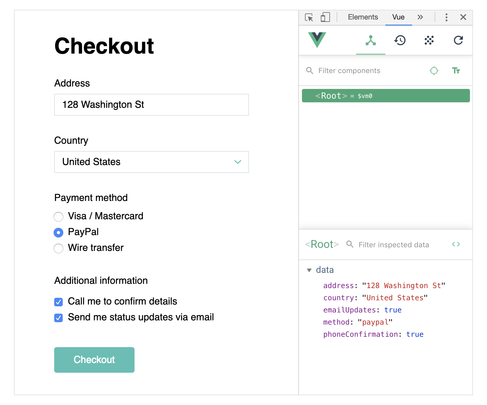

# Connecting to forms

As mentioned previously, data is commonly used to save information users input. Vue.js provides a special attribute `v-model` that allows to connect variables with basic form controls: text inputs, checkboxes, radio buttons and dropdowns. 

::: tip Important
`v-model` establishes a **two-way connection**. This means that changes made to a control are immediately applied to a variable and vice versa: when a value of a variable changes, the value of a form control changes too. 
:::

## Text

<video width="100%" controls muted class="video afterh2">
  <source src="./media/data-form-text.mp4" type="video/mp4">
</video>

If you want to save user’s text input you need to place `v-model` attribute inside `input` or `placeholder` tag and specify the name of the variable that should store the input:

```html
<div id="app">
  <input v-model="title" placeholder="Enter title..."> 
  <textarea v-model="description" placeholder="Enter description..."></textarea>
</div>
```
```js
data: {
  title: '',
  description: ''
}
```

Everything a user types into these controls will be stored in variables `title` and `description`. Note, that placeholder is a *stylistic* attribute, which means that its value is not connected to a variable.

<!-- todo: ! In variables article: say that names are case sensitive -->
<!-- ? Inputs of types *email* and *password* are connected the same way -->


## Checkbox

<video width="100%" controls muted class="video afterh2">
  <source src="./media/data-form-check.mp4" type="video/mp4">
</video>

Value of a checkbox control is binary—it’s either on or off—so it makes sense to connect it to a variable with a Boolean value. As a result clicking on a checkbox input toggles the variable’s value between true and false.

```html
<input type="checkbox" v-model="didAgreeToPolicy" id="policy">
<label for="policy">I agree with Privacy Policy</label>
```
```js
data: {
  didAgreeToPolicy: false
}
```

## Dropdown / Select

<video width="100%" controls muted class="video afterh2">
  <source src="./media/data-form-select.mp4" type="video/mp4">
</video>

To connect a dropdown to a variable you need to add `v-model` to the `select` tag. The value inside the selected ‘option’ container will be then stored inside the variable.

```html
<select v-model="plan">
  <option>Free</option>
  <option>Pro</option>
  <option>Business</option>
</select>
```
```js
data: {
  plan: 'Free'
}
```

If you want values stored in a variable to be different from texts inside `option` containers, you need to specify `value` attributes too:

```html
<select v-model="country">
  <option value="ca">Canada</option>
  <option value="mx">Mexico</option>
  <option value="us">United States</option>
</select>
```

Either `ca`, `mx` or `us` will be stored in a variable `country` when an option is selected, not `Canada`, `Mexico` and `United States`. This is useful when you want to have long descriptive lables in the UI, and short neat values in your data.

<!-- - Similarly to radio buttons, you can specify ‘value’ for each option if you want it to be different from the actual content between ‘option’ tags. As with radio buttons, it’s recommended to have them the same.  -->

## Radio buttons

<video width="100%" controls muted class="video afterh2">
  <source src="./media/data-form-radio.mp4" type="video/mp4">
</video>

To connect a group of radio buttons to a variable you need to add `v-model` to selected radio buttons and specify the same variable in all of them:

```html
<div>
  <input type="radio" v-model="emailsDaily" value="One" id="one">
  <label for="one">Just one</label>
</div>
<div>
  <input type="radio" v-model="emailsDaily" value="Two" id="two">
  <label for="two">Twice a day</label>
</div>
<div>
  <input type="radio" v-model="emailsDaily" value="Three" id="three">
  <label for="three">All three</label>
</div>
```
```js
data: {
  emailsDaily: 'One'
}
```

Unlike in dropdowns the `value` attribute is mandatory for radio buttons. It carries the value that will be assigned to a variable when the radio button is clicked.

In Layout basics [you've learnt](./../../LayoutBasics/Core/form.md#radio-button) that you have to assign `name` attribute to tie radio buttons into a group. Connecting a radio button to a variable with `v-model` eliminates that need, because now its state is defined by the value of the variable, not other controls with the same `name`. 

<!-- todo: Maybe a link to how to bind values if number is required, not string — common bug -->

## Self-practice

### Task 1

Connect form controls to variables:



1. Download the [starting file](./../../../course-files/interaction-basics/data/data-forms-practice-1-start.html.zip), open in it Chrome and study the layout.
2. Open it in VSCode, find form controls in the layout and variables in the data section.
3. Use `v-model` and `value` where necessary to connect form controls to corresponding variables.
4. Check your progress in Chrome. Open Vue dev tools, select `<Root> ` in the upper section and see if the values are changed when you interact with the form. 

If you have problems completing the task download the [final result](./../../../course-files/interaction-basics/data/data-forms-practice-1-end.html.zip).

### Task 2

Display information a user inputs:

<video width="100%" controls muted class="video afterh2">
  <source src="./media/data-form-practice-2.mp4" type="video/mp4">
</video>

1. Create a new prototype from the [template](./../Setup/). 
2. Create a two column layout with a simple form on the left and empty containers on the right.
3. Create variables for each form control and connect them with `v-model`.
4. Display values of the variables in the right column. Use Photo URL data to display an image ([UI Faces](https://uifaces.co/?provider[]=1) is used in the example). Revisit [previous article](./display.md) if you find this task challenging.

If you have problems completing the task download the [final result](./../../../course-files/interaction-basics/data/data-forms-practice-2-end.html.zip).