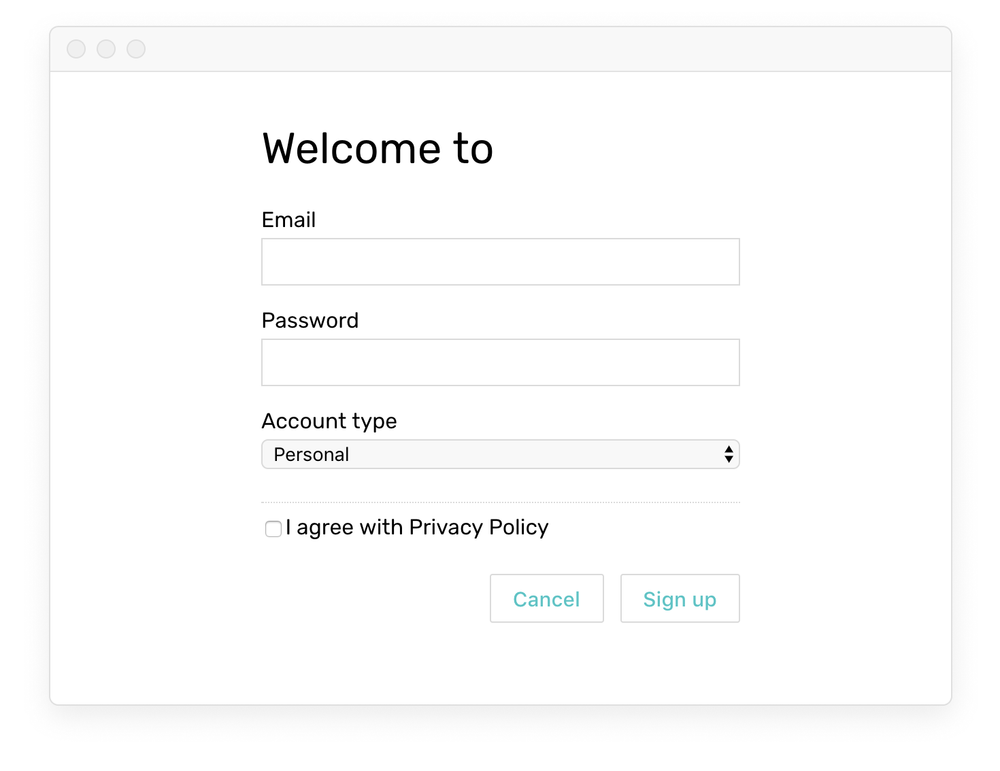
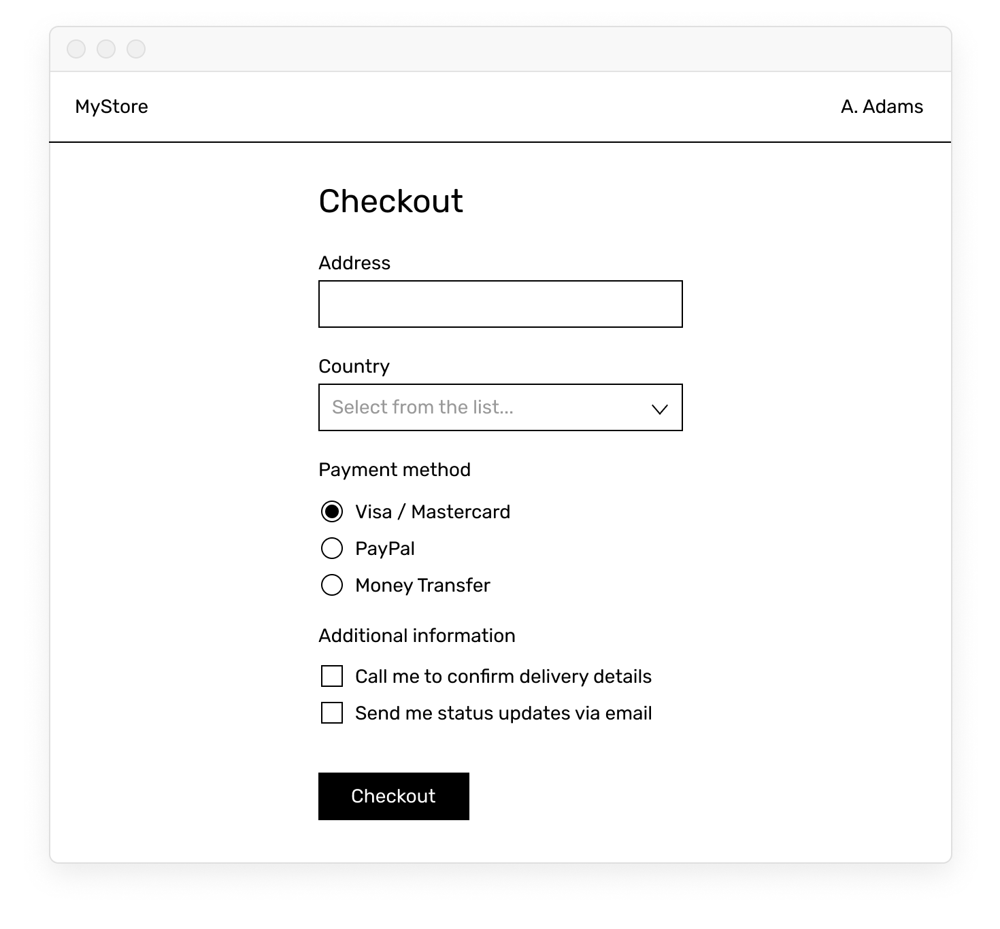

# Practice

## Task #1

1. [Download](https://firebasestorage.googleapis.com/v0/b/mockupless.appspot.com/o/self-practice%2Fdata%2Fsignup.html.zip?alt=media&token=26cc5f40-aa94-4328-80e4-786676bd382d) the template which already includes the layout:

2. Come up with the name of the app, save it as a [variable](./README.md) and [display](./display.html#displaying-in-containers) it in the title after “Welcome to”

3. Create a variable for each form input and [connect](./display.html#connecting-to-form-inputs) all variables to inputs in your html

4. Make sure everything works properly. Open [Vue devtools](./../Setup/devtools.html), click on `<Root>` in the upper panel, and see if data you input in your form appears in the lower panel next to the appropriate variables:

! ! ! ! keypress.enter

## Task #2

1. Start from the blank prototyping [template](./../Setup/README.md)
2. Create a layout similar to the shown but with your own styles:

2. Store username as a [variable](./README.md#variables) and [display](./display.html#displaying-in-containers) it in the layout
3. Create a variable for each form input and [connect](./display.html#connecting-to-form-inputs) all variables to inputs in your html. Good luck with [radio buttons](./display.html#radio-buttons) 😉
4. Make sure everything works properly using [Vue devtools](./../Setup/devtools.html)