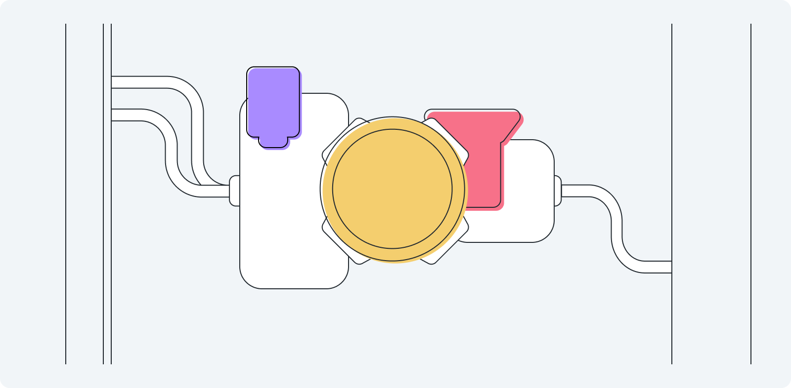

# Functions



You already use containers for content in layout — divs. You use containers for data — variables. It was only a matter of time before you discovered there are containers for instructions too 💁‍♀️.

Meet **functions** — a powerful named container for your instructions that helps you avoid repeating same code many times and jam multiple instructions directly into event listeners.

## Creating a function

<!-- > video -->
<!-- todo: but the example should be at least a litte different from managing containers -->
<!-- todo: maybe no video here? -->

In the [Managing lists](./../Lists-and-loops/arrays-methods.md) sections you’ve seen examples of having multiple instructions assigned to one event listener. On top of that, different events may need the same set of instructions:
<!-- todo: currently this is not truth, no multiple instructions there, not repeating ones either -->

```vue
<input v-model="newTask" @keypress.enter="tasks.push(newTask); newTask = ''">
<button @click="tasks.push(newTask); newTask = ''">
  Add
</button>
```

A simple layout with an input and a button becomes quite busy this way. Also you have to keep in mind that if you make changes to instructions of one event listener, you probably should make them in another listener too, because those two events must behave identically.

There's a way to store a set of instructions in a separate container - **a function** - and call for it from as many event listeners as you want. First, you create a function inside `methods` container of your [template](./../Setup/) with instructions inside:

```js
methods: {
  addItem () {
    this.items.push(this.input)
    this.input = ''
  }
}
```

Let's review parts of this code one by one:
- First comes the name — `addItem`. Just as with data variables you pick a name yourself. Best practices for naming are also the same: make sure the name helps understanding what a function does, and use camel case for names that consist of multiple words.
- The name is followed by a pair of parenthises. This is where parameters go. This is explored in the following article, and for now they just stay empty.
- The body of a function, **instructions**, is enclosed in curly brackets
- When referencing a variable from `data` section or another function from `methods` section, you need to put `this.` in front of the name—something you didn’t have to do when you wrote instruction right into event listener.

:::tip this.
The use of `this.` is a complex topic that requires understanding scope of variables. A simple, yet not exactly accurate, explanation is this: a function is universe of its own that allows you to create variables and functions inside of it. Functions are also independent, so they allow you to name your variables and functions whatever you want, meaning you may (doesn't mean you should) use the names you've already used in your `data` container. For a function to be able to understand that you are referencing a variable or a function outside of the function, you need to add `this.` in front of the name.
:::

## Using a function

<!-- Now that your instructions are stored in a function, instead of writing them directly into event listeners, you  -->
<!-- Now that your instructions are stored in a function, you can use the  -->
<!-- Now that your instructions are stored in a function, all you have to do to activate them is to use  -->

To access the function you've created, you need to call it by its name in your event listeners, where instructions lived previousely:

```html
<input v-model="newTask" @keypress.enter="addItem()">
<button @click="addItem()">
  Add
</button>
```

The syntax simple: the name followed by parentheses that you will later use for parameters. Both event listeners can be read as “when the event happens, call the function `addItem` to execute instructions it has”.

### Hands-on


<!-- With this function in place, all you have to do is to reference it in your event listeners:

```js
@keypress.enter, @click="addItem()"
```

Exercise 1: ?

Exercise 2: ? -->
