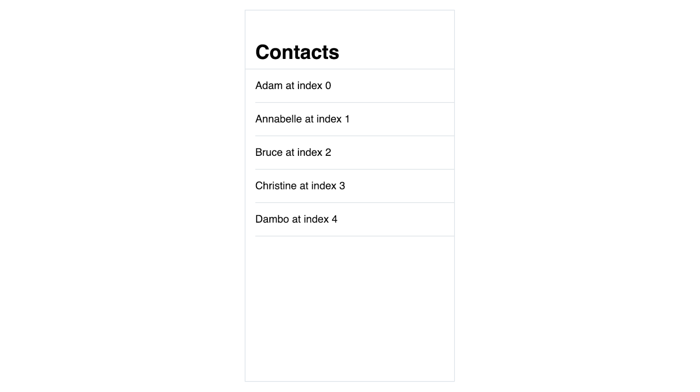

# Selecting from a list

:::danger
current version of the article expects the knowledge of listeners and click event
:::

Let's extand the prototype from the previous article with the details view that shows the name of the selected contact.


<!--
the above could be a nice Principle animation maybe? Smooth, but may be far from the expected result
Maybe screencasts of actual prototype? Harder to make look smooth, but the actual result is shown
-->

The task is fairly simple: you need a variable to store the name of the selected item and display the value of the variable in details view. The problem with arrays is that we don't see any names of the items, only values separated by commas:

```js
data: {
  contacts: ['Adam', 'Annabelle', 'Bruce', 'Christine', 'Dambo']
}
```

let's see how this can be solved

## Indexes

Even though items don't have names, we can still access them because they are numbered starting with 0. You can think of the first item in the array as a variable `0: 'Adam'`, the second one `1: 'Annabelle'` and so on. The number is called **an index**.

To access variables inside an array in your layout you put square brackets with the index next to the name of the array variable:

```vue
<div>
  {{contacts[0]}}
</div>
```

This reads as “show the value of `contacts` array's variable at index 0”. This container will display `Adam` as its content.

## Variable as index

In your prototype, you don't want to just display the first item from the array. You want to display the selected item.

For this you need a variable to store the index of the selected item:

```js
data: {
  selectedContact: 0
}
```

In your layout you can now use this variable as an index to display the selected item:

```vue
<div>
  {{contacts[selectedContact]}}
</div>
```

The syntax and the idea is the same: “show me the value from an array at a particular index”, but instead of a particular number you specify a variable, so it can be changed when interacting with prototype.

## Index in v-for attribute

Now that you have a list of contacts on the left rendered with a `v-for` loop, and the value of the selected item redered on the right with `selectedContact` variable used as an index, the question remains: when an item is selected from a list, how do you know its index?

When creating your loop [initially](./lists.md#loop) you created a temporary variable `contact` to refer to the value in your layout. Similarly, you can create a temporary variable for the index of this variable:

```vue
<div v-for="(contact, index) in contacts" class="border-b border-grey py-4">
  {{contact}}
</div>
```

<!-- The syntax? As with the `contact`, the name of the temporary variable you use for the index is up to you.  -->

Now for each item in the array the container is created, and each container has access to the item's value and index. This means that you can now add click event listener to the container, that will assign the index of the clicked container to `selectedContact`:

```vue
<div v-for="(contact, index) in contacts" @click="selectedContact = index" class="border-b border-grey py-4">
  {{contact}}
</div>
```

#### 👐 Hands-on

Download the [sample file](./../../../course-files/interaction-basics/lists-contacts-3.html.zip)

## 👶 Self-practice: basic