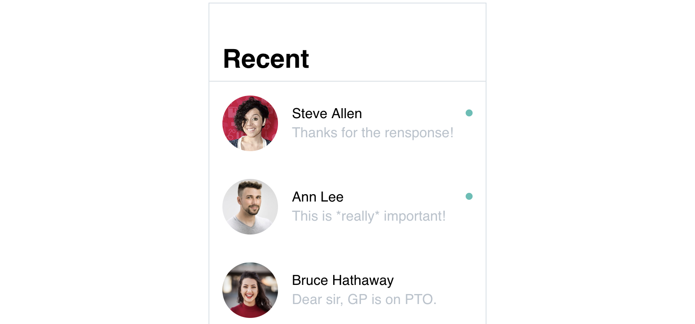
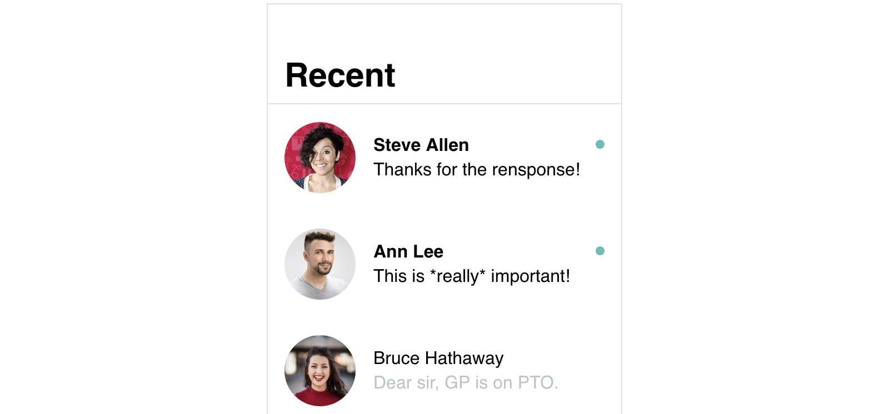

# Objects pro

An item in a object can be treated as a variable in many ways. When you use an array of objects to create a list, you can use object’s variables not only to render some values. You can use them as source properties for images, to render conditional elements and add conditional styles.

For every piece of data you want to use in a list item, you need to have a variable in your object, so let's go back to the code from previous article:

```js
data: {
  contacts: [
    {
      firstName: 'Steve',
      lastName: 'Allen',
      latestMessage: 'This is *really* important!',
      unread: 1,
      avatar: 'http://image.com'
    },
    {
      firstName: 'Ann',
      lastName: 'Lee',
      latestMessage: 'Thanks for quick turnaround!',
      unread: 2,
      avatar: 'http://image.com'
    },
    /* ... + many more */
  ]
}
```

For now you have used only three variables to render full name and message inside an item:

```html
<div v-for="contact in contacts">
  <div>
    {{contact.firstName}} {{contact.lastName}} 
  </div>
  <div>
    {{contact.latestMessage}}
  </div>
</div>
```

The time has come to figure out the rest.

## Image source


```html
<div v-for="contact in contacts">
  <div>
    
  </div>
  <!-- name and message code here -->
</div>
```

- Download [prototype](./../../../course-files/interaction-basics/objects-2.html.zip)

## Conditions



```html
<div v-for="contact in contacts">
  <!-- avatar, name and message code here -->
  <div v-if="contact.unread !== 0">
    <div class="rounded-full bg-teal w-2 h-2"></div>
  </div>
</div>
```

- Download [prototype](./../../../course-files/interaction-basics/objects-3.html.zip)

<!-- todo: ( a cut screenshot with three elements, first two having a dot)

You can make elements of your template conditional the same way you do it outside of lists: with v-if and a condition:

(extended code that shows a v-if container for unread indicator)

An object’s variable isUnread is used as a condition, and as a result items with true value will have a colored dot.  -->


## Conditional style



```html
<div v-for="contact in contacts">
  <!-- avatar code here -->
  <div :class="{'font-semibold': contact.unread !== 0}">
    {{contact.firstName}} {{contact.lastName}} 
  </div>
  <div :class="{'text-grey': contact.unread === 0}">
    {{contact.latestMessage}}
  </div>
  <!-- dote indicator code here -->
</div>
```

- Download [prototype](./../../../course-files/interaction-basics/objects-4.html.zip)

<!-- todo: ## Background -->
<!-- :style with 'url(' + object.key + ')' — but this stuff may be just a little too confusing at this point -->

## Self-practice

> Coming soon