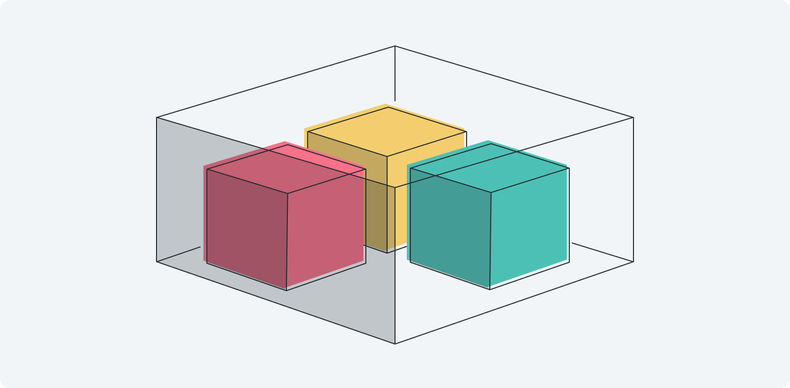
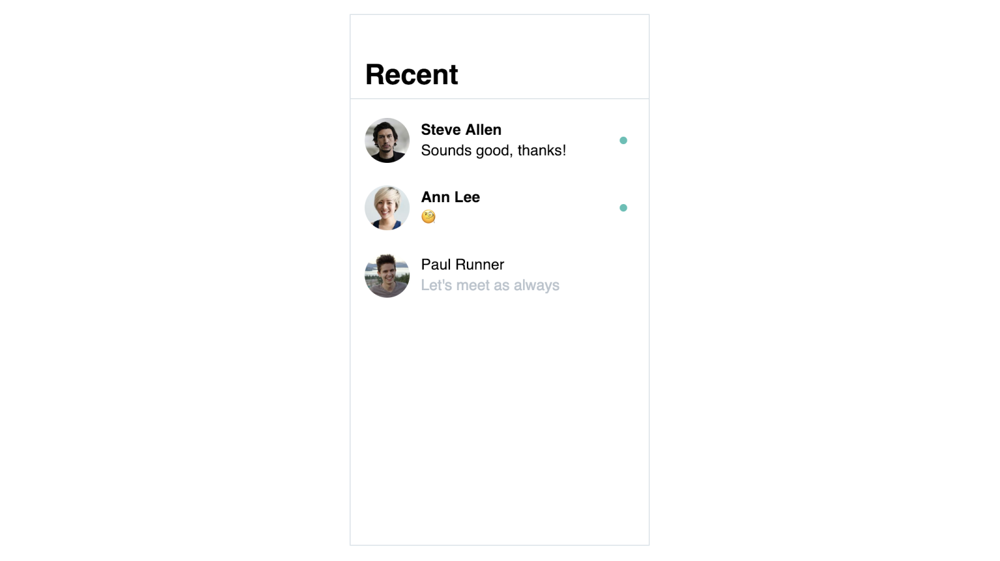
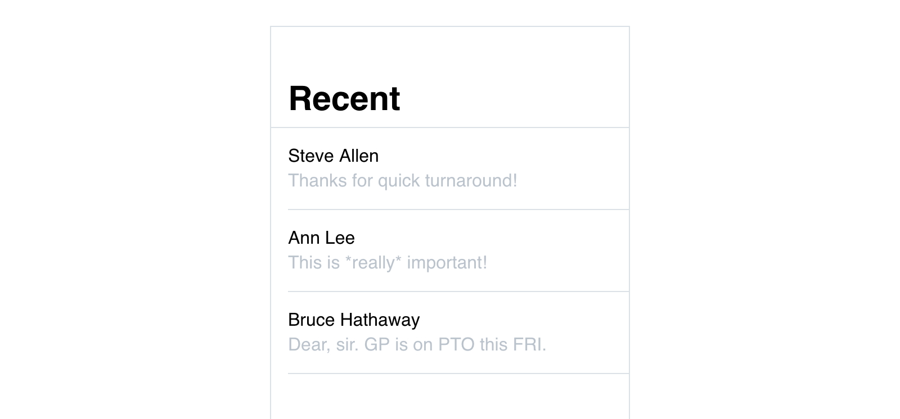
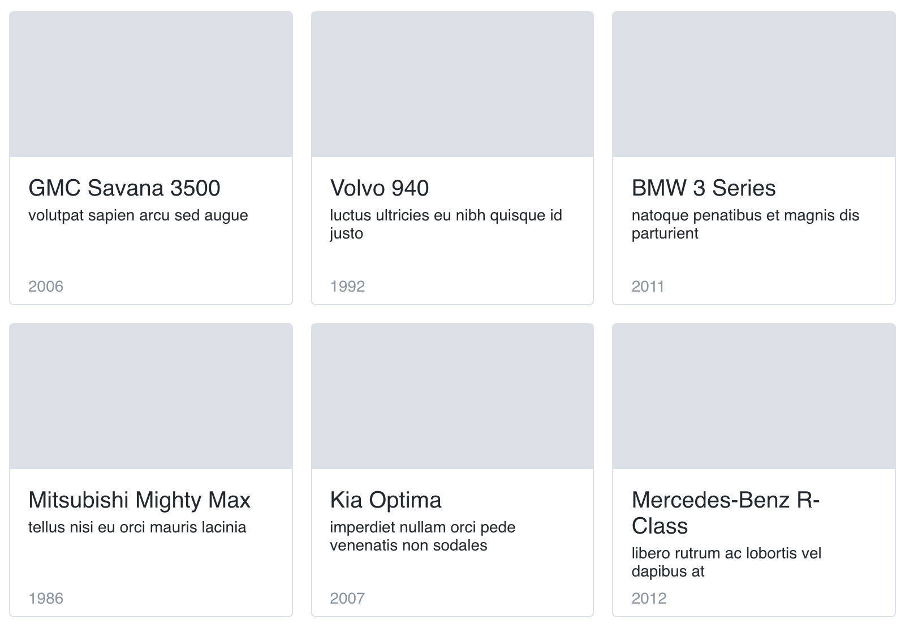

# Objects


<!-- todo: this illustration must be fixed 🙈 -->

You've created a basic list of contacts in [Lists](./lists.md) section using an array of names and a `v-for` loop. But in real-life prototyping lists are usually a little more complex. For example, in a list of recent conversation each item may contain not only a name, but also a picture, a message and unread indicator:



When you need to store an item that has multiple types of data in it, you create an **Object**. Objects are similar to arrays in a way they contain multiple variables, but unlike in arrays, variables are not given indexes, but you define **names** for them instead.

Take a look at the object that you can use for **one** of the items in our Recent conversations UI:

```js
data: {
  contact: {
    firstName: 'Steve',
    lastName: 'Allen',
    latestMessage: 'This is *really* important!',
    unread: 0,
    avatar: 'http://image.com'
  }
}
```

The content of an object is placed within curly braces and its items are separated by commas. Each item is a variable with a name and a value separated by colon. 

:::tip Good eye
Does this syntax look familiar? This is exactly the way **data** container you use to store all your [variables](./../Data/#variables) is build. This is not a coincidence — data container is in fact an object.
:::

<!-- Similarly to the way you use arrays' [indexes](./indexes.html#indexes) to access their items in your layout, you use names to access your objects' items: -->

### Accessing object's variables

To access items stored inside an object you reference the object by its name followed by a dot and followed by the name of a parameter:

```html
<div>
  {{contact.firstName}} {{contact.lastName}} 
</div>
<div>
  {{contact.latestMessage}}
</div>
```

The layout above will use `contact` object to render its parameters: `firstName` and `lastName` in the first containers, and `lastestMessage` in the second. 

### Array of objects

To create a list of recent conversations you need not one but many objects. As you've learned from the previous sections, to render a list you need to store items in the array, and an a array is a list of variables of **any** type. This means if you need a list of complex items, you need an array of objects. 

This kind of an array does look massive in code, but doesn't introduce anything new, just a combination of what you've learnt previousely:

```js
data: {
  contacts: [
    {
      firstName: 'Steve',
      lastName: 'Allen',
      latestMessage: 'This is *really* important!',
      unread: 1,
      avatar: 'http://image.com'
    },
    {
      firstName: 'Ann',
      lastName: 'Lee',
      latestMessage: 'Thanks for quick turnaround!',
      unread: 2,
      avatar: 'http://image.com'
    },
    {
      firstName: 'Bruce',
      lastName: 'Hathaway',
      latestMessage: 'Dear, sir. GP is on PTO this FRI.',
      unread: 0,
      avatar: 'http://image.com'
    }
  ]
}
```

This block looks busy, but it's still an array — a list of items wrapped in square brackets and separated by commas. And each item is an object: a list of varibles wrapped in curly braces and separated by commas.

With an array of objects in place, you are all set to render it.

### Rendering lists of objects

Displaying a list of objects is no different from rendering other types of lists you've seen so far. You create a template-container with `v-for` attribute connected to the array and use the temporary name, for example `contact`, to access items in the array:

```html
<div v-for="contact in contacts">
  <div>
    {{contact.firstName}} {{contact.lastName}} 
  </div>
  <div>
    {{contact.latestMessage}}
  </div>
</div>
```

Note, that you are dealing with an array of objects, so `contact` is a name an object in the array receives, you access its variables as shown in the [beginning of this article](#accessing-object-s-variables) — with a dot followed by the variable's name.

### Hands-on



- Download the [prototype](./../../../course-files/interaction-basics/objects-1.html.zip).
- Open it in VSCode, study the array and template-container.
- Try adding a couple of objects to the array. <!--todo: show this being done in the video-->

In the next article you'll implement images together with conditional styles and elements.

## Self-practice

### Cars catalog

Create a grid of cards with an array of objects: 



1. Download [starting prototype](./../../../course-files/interaction-basics/practice-objects-grid-start.html.zip).
2. Connect the card container to `cars` array with `v-for` attribute.
3. Display make, model, description and year for each item.
4. Add a couple of items to an array to have 6 in total.
5. Fix card layout so all cards have the same height. 

If you have any problems completing the task, dowload and review the [solution](./../../../course-files/interaction-basics/practice-objects-grid-end.html.zip).

<!-- ### Task 2: Tab bar -->

<!-- todo: each tab is an object with a name and number of new items, this can be used in the next article to add “if 0 don't show” logic behind it -->

<!-- todo: make sure the second task is more complex and includes adding/deleting -->
