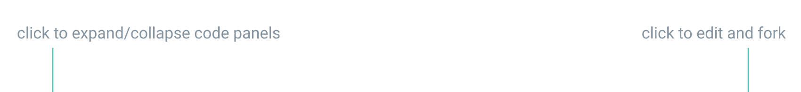

# Practice

Most articles have tasks for you to practice new material. Completing them is optional yet highly recommended. Some tasks aim to be as close as possible to real-world experiences and some are relatively abstract—crafted purely for the sake of you getting a deeper understanding of the technology. 

Each task comes with a complete prototype. If you struggle with a task or you want to compare your prototype’s code to the one from an article, you can view the code of the complete prototype by opening HTML, CSS or JS panels. You can also view it in full screen, edit and fork by pressing Edit on CodePen.

<iframe height="272" style="width: 100%; margin: -24px 0 12px;" scrolling="no" title="Interaction basics—Practice" src="//codepen.io/andgordy/embed/EJbrMW/?height=272&theme-id=36403&default-tab=result" frameborder="no" allowtransparency="true" allowfullscreen="true">
  See the Pen <a href='https://codepen.io/andgordy/pen/EJbrMW/'>Interaction basics—Practice</a> by And Gordy
  (<a href='https://codepen.io/andgordy'>@andgordy</a>) on <a href='https://codepen.io'>CodePen</a>.
</iframe>

Trying to apply newly-obtained knowledge can be challenging sometimes. Remember, you’re not alone on your journey. Feel free to ask for help, share your progress and assist others on [Interaction basics forum](https://spectrum.chat/mockupless/interactions-basics).