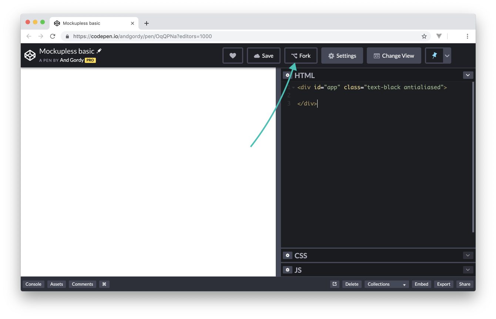
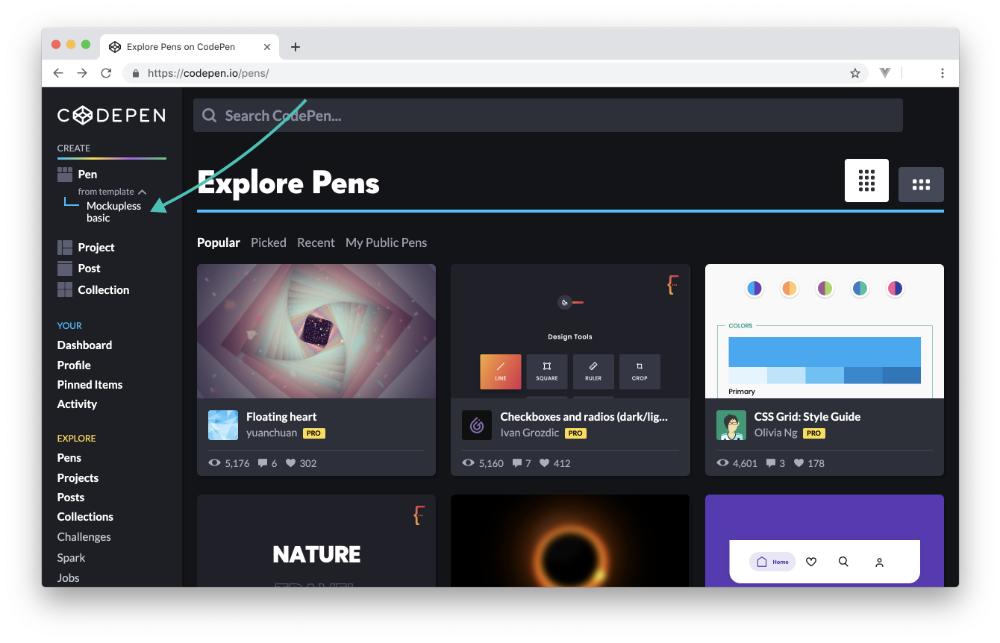

# Prototyping template

In Layout basics you learnt how to use [CodePen](https://codepen.io), create new pens and fork existing ones. In [Tailwind](./../../LayoutBasics/Tailwind/whats.md) and [Ionicons]() sections you also learnt to import libraries into your pens. However, creating a new pen, importing frameworks and setting up the contents for every new prototype is not the most time-efficient workflow.
<!-- todo: link: to articles -->

After prototyping for a while you’ll be able to define your default set of tools and create **templates**—files with minimal to no content but with a particular setup. You can use templates to kick off new prototypes without having to set everything up from scratch. 

This course is using the [Mockupless basic](https://codepen.io/andgordy/pen/OqQPNa) template and we recommend you to use it too when progressing through the course. This way you can be sure your environment matches the one in the articles. 

## Fork and use

Open the [Mockupless Basic](https://codepen.io/andgordy/pen/OqQPNa) template and fork it:



Now go to CodePen’s home page and locate *from template* button under the *Create Pen*. When you press it you should be able to see *Mockupless basic* as an option:



 Choose it and you’re done: a new pen is created from the template.

## What’s inside

### Freameworks

There are three libraries/frameworks imported in the template:

- Tailwind and Ionicons can be found in the CSS settings (gear icon on the left of CSS section header)
- Vue.js is imported in JS settings (gear icon in the JS header)

### HTML

The HTML code includes a single container with `id="app"` and a couple of default classes:

```html
<div id="app" class="text-black antialiased">
  <!-- layout goes here -->
</div>
```

`antialiased` class makes font rendering closer to what you are used to in design tools, and `text-black` resets the default text color to Tailwind’s black, so your texts fit better into the color palette.

#### 🚨 Important 
Make sure you place all contents of your prototypes inside this container. Everything you put outside will not be recognized by Vue.js and may produce errors.

### CSS

The CSS block resets some styles of form controls. It removes glow from inputs when they are in focus, sets the color of placeholders and changes the default design of dropdown controls.

### JS

The JS block has a Vue instance:

```js
var app = new Vue({
  el: '#app',
  data: {
    // variables go here
  },
  methods: {
    // functions go here
  }
})
```

Technical details of what Vue instance is and how exactly it works are irrelevant to the interaction basics covered in this course. What's really important is it has two containers:

- `data` is used to store variables.
- `methods` is used to store functions.

Variables are covered in the next section so you will work with `data` container throughout the whole course. Functions are briefly described towards the end of the course so you’ll get a chance to work with `methods` then.


## Customization

The Mockupless basic template includes the just-enough setup. It doesn’t mean your own template has to be minimalistic too, if you decide to create one. You are free to include multiple custom fonts, icon and style libraries together with JavaScript frameworks of your choice. When the time comes you can create a template from scratch or use Mockupless basic as a foundation.

To create your own template on CodePen, fork an existing pen or create a new one, go to pen’s **Settings** (button on the top right) and switch from Regular Pen to **Template** under the **Pen Details** tab. 


 


