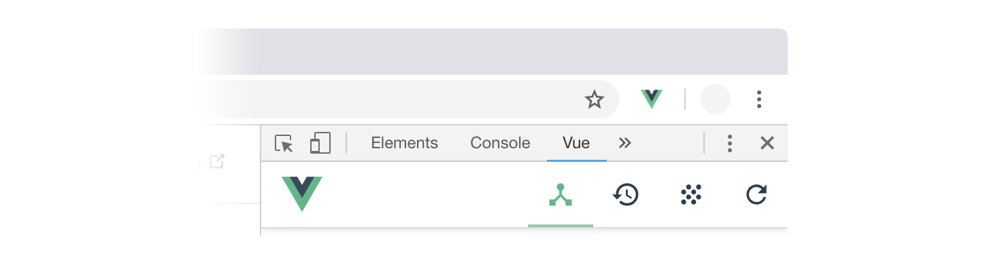

# Vue dev tools

## Install and setup

1. Add Vue.js devtools from [Chrome web store](https://chrome.google.com/webstore/detail/vuejs-devtools/nhdogjmejiglipccpnnnanhbledajbpd).
2. *Right-click* the Vue icon on the right side of Chrome's toolbar and select “Manage Extensions”. If you don't see the icon open Chrome menu and find it there.
3. In extension settings scroll down to *Allow access to file URLs* and turn this setting on. This allows devtools to identify Vue in local .html files you open.

All set up. You may close extensions tab.

## Access

1. Open .html file with Vue.js imported into it — for example, the template you've created in [previous step](./template.md). The Vue icon is supposed to become green, indicating that Vue.js is detected on the page.
2. Open developer tools: *option+command+I* or *Menu → More Tools → Developer Tools*
3. Find a tab called Vue and select it. If the Vue tab is not visible, check the **»** menu

