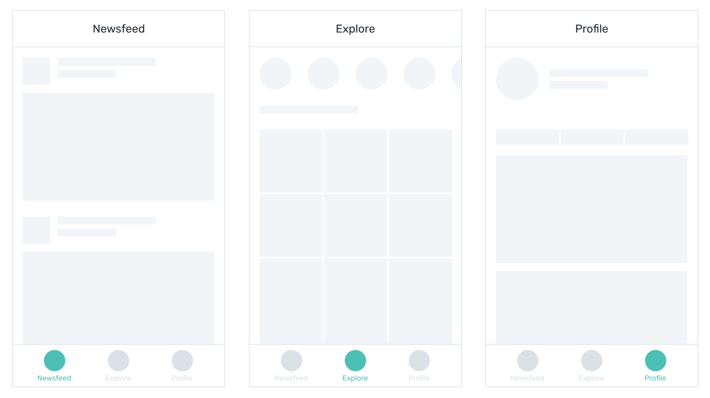
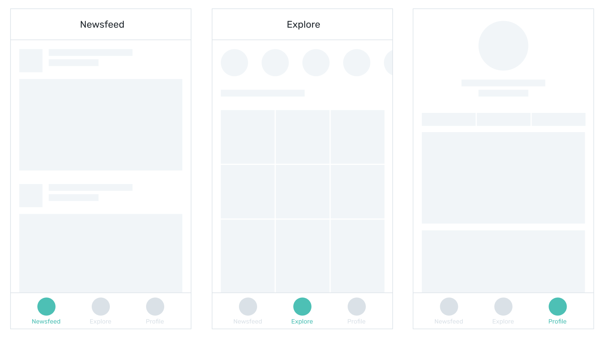
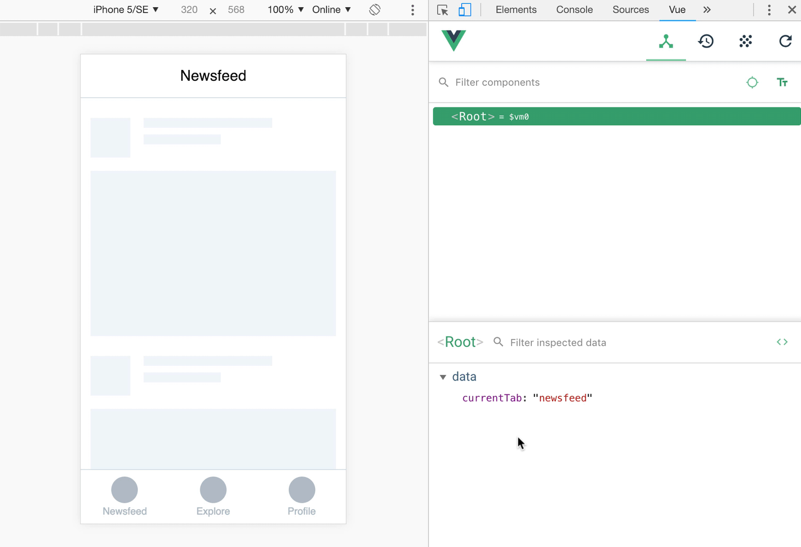

# (in)Equality

## Equality

Let's say you are creating a prototype with 3 tabs:



Each tab has a corresponding view, which is supposed to be shown when its tab is selected. The task is similar to the one you had in the previous article with one exception: the condition is not binary anymore — it's not “show either this or that”. Now you have 3 options to deal with, and there could be more.

As before, you start with creating a variable that you will use in your conditions. But instead of a boolean that can only have either of two values, you use a string, because it can be anything, including the name of the tab:

```js
data: {
	currentTab: 'newsfeed'
}
``` 

Now in your `v-if` attributes you check whether the variable **equals** to a particular value for each container:

```html
<div v-if="currentScreen === 'newsfeed'">
  <!-- Newsfeed content -->
</div>
<div v-if="currentScreen === 'explore'">
  <!-- Explore content -->
</div>
<div v-if="currentScreen === 'profile'">
  <!-- Profile content -->
</div>
```

The expressions above can be read as “show the container only if the value of `currentScreen` equals to this”. Since the default value for `currentScreen` is `newsfeed`, only the first container will be shown in a browser.

:::tip Note
Using 3 equal signs for equality may look like an overkill, but single equal sign has a very different meaning in javascript, and two equal signs
just don't look fancy enough (and may lead to some unexpected behavior).
:::

To test this, download the [file](https://firebasestorage.googleapis.com/v0/b/mockupless.appspot.com/o/conditions%2Fequality-1.html.zip?alt=media&token=a97ad90b-f3e5-451e-8dd6-38b2fec4441c), open it in Chrome, use Vue devtools to change the value of `currentScreen` to `"explore"` or `"profile"`. Note, that devtools expect you to use double quotes when you change the value in browser:


You won't see the tabs style and title changing yet, but you'll deal with that soon.

## Inequality

You build a nice consistent UI, but then you decide that the profile view can be so much fancier, and it doesn't need the navbar at all:



Your task is to show navbar container on all scerens except for Profile tab. The variable remains the same: `currentScreen` — but the condition for showing the element is different. Now you want the element to be shown if the variable does **not** equal to `'profile'`.

The way you check for inequality is actually a symbiosis of the two: [equality](./equality.md#equality) from the section above and [not](./rendering.md#not) operator from the previous article:

```html
<div v-if="currentScreen !== 'profile'">
  <!-- navbar content -->
</div>
```

The expressions above can be read as “show the container only if the value of `currentScreen` is not `profile`”. As a result the navbar will be shown with any other value assigned to `currentScreen` including `'newsfeed'`, `'explore'` and anything you may come up with later.

Test this by downloading the sample [file](https://firebasestorage.googleapis.com/v0/b/mockupless.appspot.com/o/conditions%2Fequality-2.html.zip?alt=media&token=7e901b74-1062-4011-8669-0c87bc0295b0) and changing the value in Vue devtools to `'profile'` and then to anything else.



## Self-practice: basic

Use the prototype from inequality section and make the title in the navbar conditional, so it shows Newsfeed when `currentScreen` equals `'newsfeed'`, and Explore when it's equal to `'explore'`:


1. Download the sample file [file](https://firebasestorage.googleapis.com/v0/b/mockupless.appspot.com/o/conditions%2Fequality-2.html.zip?alt=media&token=7e901b74-1062-4011-8669-0c87bc0295b0).
2. Locate the navbar section.
3. Put the `Newsfeed` text into `span` container and add `v-if` attribute to it, that shows the container only if `currentScreen` is `'newsfeed'`.
4. Create another `span` container next to it with text `Explore` and `v-if` attribute , that shows the container only if `currentScreen` is `'explore'`.
5. Test in Chrome by changing value to `'explore'`.

:::tip Note
You are wrapping titles in span containers and not divs, because you don't want to change the layout, but you need something to attach `v-if` attribute to, and span is just perfect for job.
:::