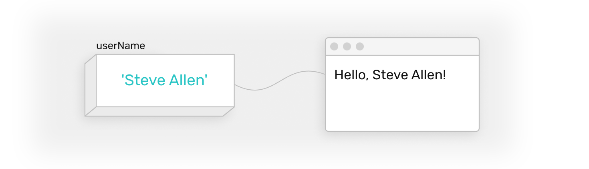

# Connecting data

## Displaying in containers



Once the data is stored in a variable, you can display its value in your html:

```html
<div>{{itemsInCart}}</div>
```
```js
data () {
  itemsInCart: 2
}
```
The two pairs of curly braces is your way to indicate that *itemsInCart* is a variable and you want its value placed in your html content.

## Connecting to form inputs

There's so much more than just displaying data in a container. Another common case is to use variables to save input from forms.

### Text
::: warning todo
write an intro about text. examples: email, task
:::

```html
<input v-model="email"> 
```
```js
data () {
  email: 'support@mockupless.com'
}
```

### Checkbox
::: warning todo
write an intro about text. boolean. examples: disable button if policy not accepted
:::

```html
<input type="checkbox" v-model="didAgreeToPolicy"> I agree with Privacy Policy
```
```js
data () {
  didAgreeToPrivacyPolicy: false
}
```

### Radio buttons
::: warning todo
write an intro about text. each separately to one data source.
:::

```html
<div>
  <input type="radio" v-model="emailsDaily" value="One"> Just one
</div>
<div>
  <input type="radio" v-model="emailsDaily" value="Two"> Twice a day
</div>
<div>
  <input type="radio" v-model="emailsDaily" value="Three"> All three
</div>
```
```js
data () {
  emailsDaily: 'One'
}
```

### Select / Dropdown
::: warning todo
write an intro about text.
:::

```html
<select v-model="plan">
  <option>Free</option>
  <option>Pro</option>
  <option>Business</option>
</select>
```
```js
data () {
  plan: 'Free'
}
```