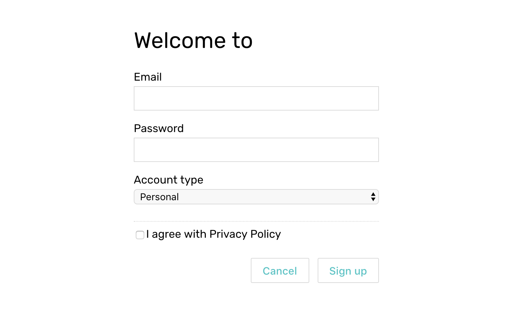

# Self-practice

[Download](https://firebasestorage.googleapis.com/v0/b/mockupless.appspot.com/o/self-practice%2Fdata%2Fsignup.html.zip?alt=media&token=26cc5f40-aa94-4328-80e4-786676bd382d) the template and follow the instructions inside to create a sign up form with data connected to the UI.

When working on the task keep Vue **devtools** open to see changes