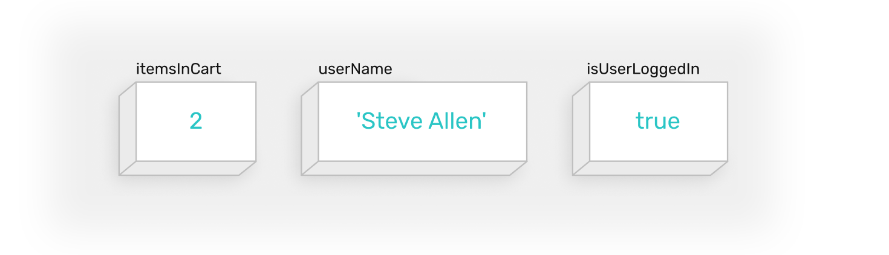

# Variables and simple data types

## Storing data



There are mainly three reasons to store data:
1. Make some content dynamic — one that may change when interacting with UI. Think numbers that increase, lists that get populated with new items, button labels that change from Save to Loading, etc.
2. Save data inputed by a user.
3. Keep track of states to show the appropriate parts of UI. Is user logged in? Ok, show dashboard. Which tab is currently selected, Profile? Ok, show the html code for Profile then and hide the others. Did turned wi-fi on? Ok, show available networks. 

## Variables

Data is stored in variables. A variable is a container with a name and a value. Value is the actual content you wish to store, and the name is a key to accessing this content.

```js
data () {
  userName: 'Steve Allen',
  itemsInCart: 2,
  isUserLoggedIn: true
}
```
* It's common to write names in [camel case](https://en.wikipedia.org/wiki/Camel_case).
* Variables are stored in `data: { }` section of vue code.
* Variables should be separated with a coma and a new line.

## Primitive data types

All data can be separated into two groups of primitive and complex data. Simple data is as simple as the name suggests, and its types are described below. Complex data types are basically collections of simple data types and are described later in the course (Arrays and Objects to name a few).

### Numbers

```js
itemsInCart: 2,
pocketMoney: 3.5,
degreesOutside: -15
```
- Can be positive, negative or zero.
- Can be an integer or decimal.
- Do not include any symbols like % and $ in value even if a percent or currency.

### Strings

String is a name for text in programming world.

```js
firstLetter: '',
userName: 'Sam Smith',
productDescription: 'Lorem ipsum dolor sit amet consectetur adipisicing elit. Perferendis eius eum enim ab doloremque quaerat quibusdam. Dolorum sint dolores rerum!'
```
- Put in single quotation marks.
- When you need to have single quotation marks inside your string, you have to add backslash before every one of them. For example: `'I\'m going to Spain!'`. When used after backslash, the single quotation mark doesn't indicate end of the string, but an apostrophe instead.

### Boolean

It is very common to save states when prototyping UI, and quite often the state is either of two: *on* or *off*. Did a user log in? Should you show a dialog box? An appropriate way to store this type of data is in a form of a boolean varibale that can have only one of two values. Later, you will learn how booleans play a crucial role when defining conditions. 

```js
isUserLoggedIn: false,
doShowConfirmationDialog: true
```
- Can be only **true** or **false**
- Written without quotation marks

### null

Sometimes it's useful to indicate that a variable doesn't have any value (yet). If you store a list of items a user has added to the shopping cart, for example, you need a way to indicate that there is nothing in it initially.

```js
listOfItems: null
```
- Written without quotation marks
- Do not confuse with zero `0` which is a number and is used for counting, and not an indication of absence of value