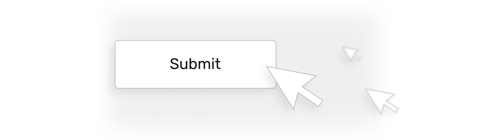

# Events

## Click



Click is the father of interactivity. Upon click, items are added and removed, containers are shown and hidden, pages are opened and animations are played. 

You need to do 2 things to make your prototype respond to a users' click:

1. Add a **click listener** to a container you expect users to interact with.
2. Specify **instructions** that you want to be executed when the click is detected.

Here's a button that adds 1 to the variable `items` when clicked:

```html
<button @click="items = items + 1">Add an item</button>
```
<div class="jsfiddle-link"><a href="https://jsfiddle.net/andgordy/eywraw8t/498829/" target="_blank">JSFiddle</a></div>

- `@` tells Vue you are specifying an event listener.
- `click` is the name of the event you want to listen to.
- The instructions you want to be executed when the event happens are specified whithin the double quotes. 
- Taps are also recognized by this listener if users interact with the prototype on touch screen devices.

### Creative freedom

You can add click listeners to any container, not only a button. This means that you can create your layouts freely, without having to use any specific containers for your elements.

Also, the click is detected not only on an element you've added it to, but also on all of its **children**.

In this exapmle a click listener is added to a complex flex container with multiple containers inside:

```html
<div @click="items = items + 1" class="button">
  <div class="icon">
    +
  </div>
  <div class="text">
    Add an item
  </div>
</div>
```
<div class="jsfiddle-link"><a href="https://jsfiddle.net/andgordy/mqhb2v30/46/" target="_blank">JSFiddle</a></div>

This way `+` and `Add an item` are in different containers each with a unique style, but both will respond to a click, because the listener is added to their parent. 

## Key press

Let's say you are prototyping a simple subscription form as a part of your interface:


You know what to do: you create a variable and connect it to the input, and you add an event listener to the Subscribe button:

```html
<input v-model="userEmail">
<button @click="subscriber = userEmail">Subscribe</button>
```

Yet chances are high, that when you start testing this interface, you'll learn that some people are used to being able to hit Return on their keyboard instead of clicking a button to submit a form.

To react to users pressing Return when the input field is focused, you need to add `@keypress.enter` event listener to the input field:

```html
<input v-model="userEmail" @keypress.enter="subscriber = userEmail">
<button @click="subscriber = userEmail">Subscribe</button>
```
<div class="jsfiddle-link"><a href="https://jsfiddle.net/andgordy/eywraw8t/498871/" target="_blank">JSFiddle</a></div>

- If you want the same results as a button click has, you use same instructions you used for @click
- `.enter` is a modifier for `@keypress` event listener. It specifies which particular button press you want to react to. If you remove a modifier `@keypress` will react to all button presses, which is rarely the desired outcome.
- Other modifiers include `.tab` and `.esc` if you want to change the default behaviour of the corresponding buttons for particular input fields.