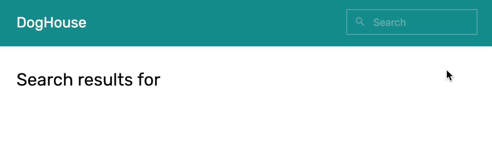

# Practice

## Task #1

Add appropriate variables and events to the template to display users' input and clear the input field when they press Enter/Return:

1. Download the [template](https://firebasestorage.googleapis.com/v0/b/mockupless.appspot.com/o/self-practice%2Fdata%2Fsearch-results.html.zip?alt=media&token=c5166645-7005-456a-a9b1-e30d7957cd63) with the built-in layout.
2. Create a variable and [connect](./../Data/display.md#connecting-to-form-inputs) it to the search input field.
3. Create another variable and [display](./../Data/display.html#displaying-in-containers) it after “Search results for ”
4. Add a [keypress.enter](./events.md#keypress) event to the input field that adds search query to the title and clears the input field. Separate your operations within one event with a semicolon, e.g. `sum = 1 + 1; diff = 4 - 2`

## Task #2

Design a prototype with appropriate variables and events to allow users increase and decrease each value in a table and calculate the sum.

1. Start from the blank prototyping [template](./../Setup/template.md#final-template).
2. Create a layout similar to the shown above but with your own styles.
3. Store all prices, quantities and a total as [variables](./../Data/variables.md#variables) and [display](./../Data/display.md#displaying-in-containers) them in the layout.
4. Create [click events](./events.md#click) for each '-', '+' and 'Calculate' buttons.
5. Make sure that your total is a sum of all prices, each multiplied by the corresponding quantity. You'll need to [group](./arithmetics.html#groupping) your operations to achieve that.

