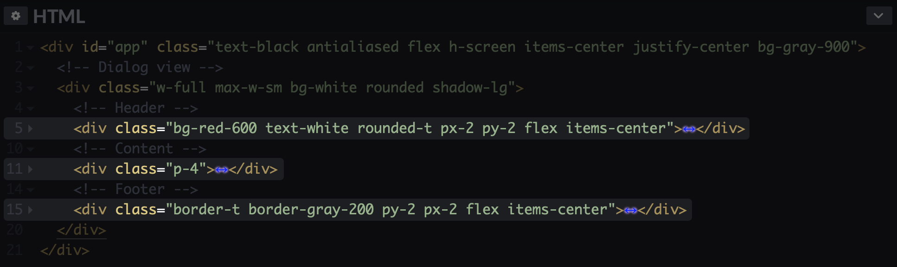

# Nesting 

Containers in HTML can be (and they almost always are) nested. This means that a container can contain other containers, which themselves can contain other containers:

```html
<div>
  <div>
    <div>Steve Allen</div>
    <div>Customer support</div>
  </div>
  <div>
    <div>Ann Lee</div>
    <div>Product design</div>
  </div>
</div>
```

You can compare this structure to the hierarchy of folders on your laptop. A folder is nested in another folder, which itself is nested in another folder, and so on, up until the root directory. The root container of the HTML part of a prototype is `body`. It is not visible on CodePen, because the whole HTML section of a pen is wrapped in `body`. Later in this course, you will learn that `body` has default styles, that you can overwrite.

The nested structure of the HTML code establishes **parent-child relationships** between containers. In the example above, the containers with “Steve Allen” and “Customer support” are children of the container they are placed in, which is called their parent:

```html
<div>                   <!--Container A. Parent of B and E -->
  <div>                   <!--Container B. Child of A. Parent of C and D -->
    <div>Steve Allen</div>      <!--Container C. Child of B -->
    <div>Customer support</div> <!--Container D. Child of B -->
  </div>
  <div>                   <!--Container E. Parent of F and G -->
    <div>Ann Lee</div>          <!--Container F. Child of E -->
    <div>Product design</div>   <!--Container G. Child of E -->
  </div>
</div>
```

As you may notice, *child* and *parent* are relative terms. For example, Container B is a child of Container A, but at the same time it is a parent to other two containers, C and D.

Nesting is an core concept in HTML. By nesting containers you create groups, and grouping allows your to create complex layouts. Take a look at the dialog view below:

<iframe height="366" style="width: 100%;" scrolling="no" title="Nesting-dialog" src="//codepen.io/andgordy/embed/PvbgmK/?height=366&theme-id=36403&default-tab=result" frameborder="no" allowtransparency="true" allowfullscreen="true">
  See the Pen <a href='https://codepen.io/andgordy/pen/PvbgmK/'>Nesting-dialog</a> by And Gordy
  (<a href='https://codepen.io/andgordy'>@andgordy</a>) on <a href='https://codepen.io'>CodePen</a>.
</iframe>

To create this layout you need one container for the dialog view, which has styles that center it on a page. This container has three child containers: the header, the main content area, and the footer. The header has its own styles (like the border at the bottom and the paddings) and it has its own children: the title and the *Info* button. The footer has styles and children too. As a result, to implement this layout, you create a nested structure of HTML containers:

```html
<!-- Dialog view -->
<div>
  <!-- Header -->
  <div>
    <div>Delete file?</div>
    <button>Info</button>
  </div>
  <!-- Body -->
  <div>
    Are you sure you want to delete?
  </div>
  <!-- Footer -->
  <div>
    <button>Cancel</button>
    <button>Delete</button>
  </div>
</div>
```

### Collapsing

CodePen and most modern code editors allow you to collapse containers by pressing a small triangle next to the line numbers. When a container is collapsed, it shows the blue glowing arrows instead of content:



Prototypes get big pretty fast. The habit of creating the sections using commenting and collapsing the sections, that you currently don’t work with, can save you a lot of time navigating the code even in relatively small prototypes.

## Practice

Create a hierarchy of containers and content for a list of cards:

<iframe height="400" style="width: 100%;" scrolling="no" title="Nesting-Task" src="//codepen.io/andgordy/embed/yWXZwZ/?height=400&theme-id=36403&default-tab=result" frameborder="no" allowtransparency="true" allowfullscreen="true">
  See the Pen <a href='https://codepen.io/andgordy/pen/yWXZwZ/'>Nesting-Task</a> by And Gordy
  (<a href='https://codepen.io/andgordy'>@andgordy</a>) on <a href='https://codepen.io'>CodePen</a>.
</iframe>

Your result will not have styles so it should look more like an example below. The idea of this exercise is to practice nesting containers and to start getting comfortable with thinking about elements on a page as groups inside groups. The design below is not pretty, but it’s a solid foundation for your future efforts:

<iframe height="330" style="width: 100%;" scrolling="no" title="Nesting-Task, no styles" src="//codepen.io/andgordy/embed/JqJxQG/?height=330&theme-id=36403&default-tab=result" frameborder="no" allowtransparency="true" allowfullscreen="true">
  See the Pen <a href='https://codepen.io/andgordy/pen/JqJxQG/'>Nesting-Task, no styles</a> by And Gordy
  (<a href='https://codepen.io/andgordy'>@andgordy</a>) on <a href='https://codepen.io'>CodePen</a>.
</iframe>

1. Create a `div` container for the first item on a list.
2. Create three child containers: one for a photo, second for a name and a date stamp, and the third for a message.
3. Create two children containers in the second container that you have just created: one for a user name, and another for a time stamp.
4. Fill the containers with content.
5. Create two more copies of the list item with a different content, so you have three items in total, as in the example above.

If the reasoning behind the grouping of the containers one way or another is not particularly clear to you now, it’s totally fine. Later in the course you will learn to apply styles to containers to position them properly in relation to each other, and the grouping should become more clear then.