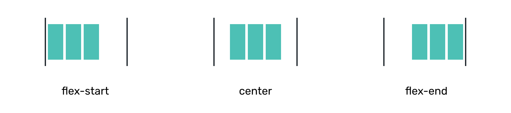
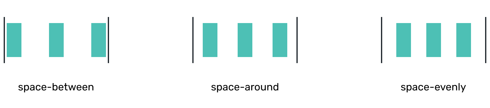

# Alignment

Applies to flex **container** <!-- todo: don't forget to stess that flex-1 applies to a child -->

## align-items


```css
align-items: flex-start;
align-items: center;
align-items: flex-end;
align-items: stretch;  /* default */
```

## justify-content



```css
justify-content: flex-start; /* default */
justify-content: center;
justify-content: flex-end;
```



```css
justify-content: space-between;
justify-content: space-around;
justify-content: space-evenly;
```

<!-- :::tip Extra mile
There's not one but three ways to distribute space around content inside flex container: `space-evenly`, `space-between` and `space-around`. **space-evenly** alone should do well for prototyping purposes but you may want [learn more](https://css-tricks.com/almanac/properties/j/justify-content/#article-header-id-1).
::: -->