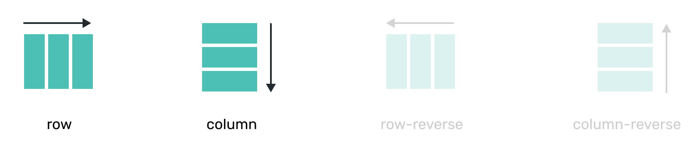
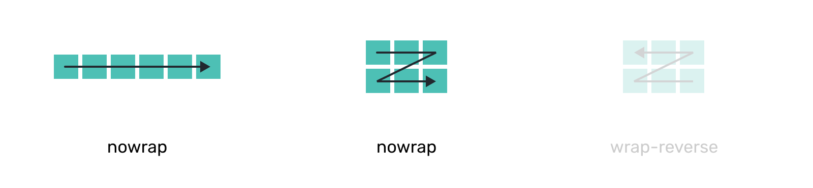

# Direction and wrap

Applies to flex **container** <!-- todo: don't forget to stess that flex-1 applies to a child -->

## flex-direction



```css
flex-direction: row; /* default */
flex-direction: column;
flex-direction: row-reverse;
flex-direction: column-reverse;  
```

## flex-wrap



```css
flex-wrap: nowrap; /* default */ 
flex-wrap: wrap;
flex-wrap: wrap-reverse;
```