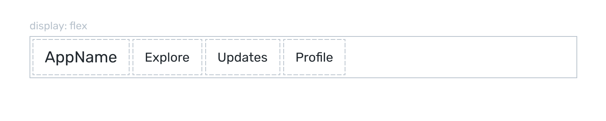
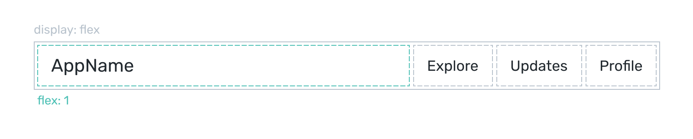

# flex: 1

## Filling the space

Let's say you are designing a prototype with a header that has navigation controls on the right:


You turn header container into flex, and you are good with the default row direction of child containers: 



Now the problem is that children of flex have width set to auto, and to push navigation items to the right, you want the left container to take **all available horizontal space** within flex container. To achieve that, you apply `flex: 1` to the child container:



Here's code:

```html
<div style="display: flex;">
  <div style="flex: 1;">AppName</div>
  <div>Explore</div>
  <div>Updates</div>
  <div>Profile</div>
</div>
```

## Nesting

A child of flex can be a flex container itself.