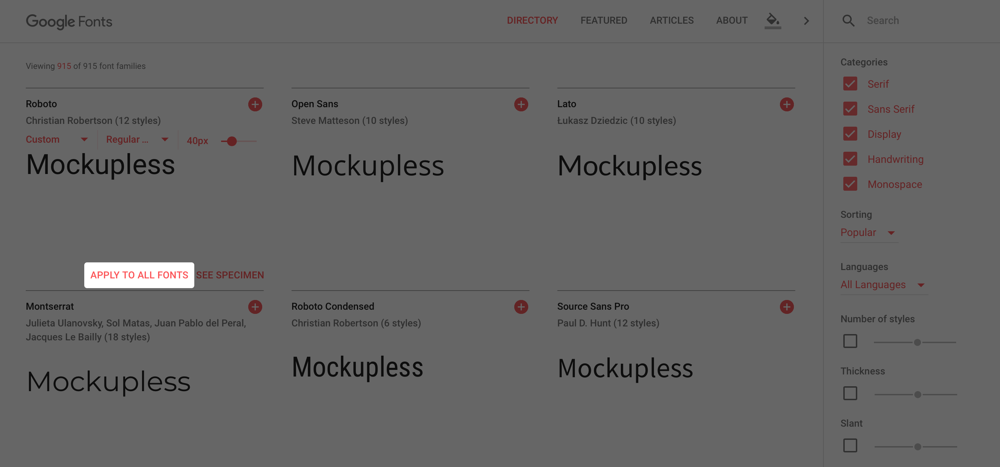
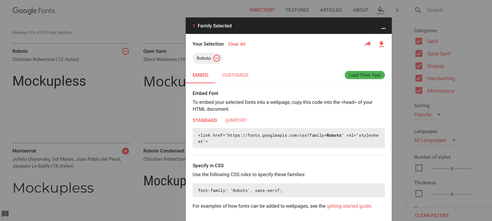
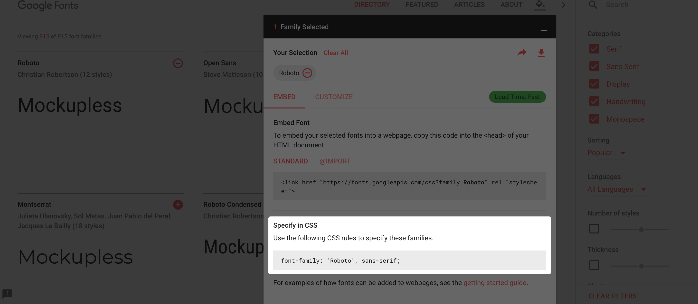

# Google Fonts

Tailwind comes packed with a solid set of web-safe [font families](https://tailwindcss.com/docs/font-family/). Usually, they should be enough for rapid prototyping, but sometimes a custom font can give a nice feel even to a lo-fi prototype. You have an option of importing a font you own, that you are allowed to use legally, but the quickest and the easiest way is to use fonts available online.

[Google Fonts](https://fonts.google.com) has a nice selection of fonts that you can use in your prototypes for free. This article briefly guides you through the process of finding fonts on Google Fonts, importing them and using them in your projects. The full guide can be found on [Google Developers website](https://developers.google.com/fonts/docs/getting_started).

### Find

First, you need to go to [Google Fonts](https://fonts.google.com) website and find a font you would like to use. You can search by name and filter by different properties like family (Categories) and weight (Thickness). You can also test any font by entering custom text and applying it to all fonts:



When you find a suitable font, click the + button to the right of its name. 

### Import

When you click the + button, a toast bar should appear at the bottom. Click it to expand the Import menu:



If you go to the *Customize* tab, you can select the weights and the languages of the font family that you want to include in your project.

Under the *Embed* tab, you will find a line of code like the one below:

```html
<link href="https://fonts.googleapis.com/css?family=Roboto" rel="stylesheet">
```

Copy this code and open your prototype on CodePen. Go to the HTML settings by clicking the gear icon in the header of the HTML section. Paste the code from Google Fonts website into the *Stuff for `<head>` area*. Save and close. The font is now included in your prototype.

### Use

To apply the imported font to the whole prototype, specify it by its name for the `body` tag and the universal selector:

```css
body, * {
  font-family: 'Roboto', sans-serif;
}
```

Remember to put the name of the font in single quotes if it consists of two or more words. You can also copy the `font-family` property from the Google Fonts’ Import menu:



### Multiple  fonts

You can add as many fonts as you want to your prototype. Select them on Google Fonts using the + buttons, and the title of the toast bar will tell you how many you have selected. The more fonts you add, the more options the *Customize* tab will have in the Import menu, and the longer the `<link>` you paste in HTML settings will be.

:::tip Performance
*Load time* indicator tells you how big the font file that you are going to import is. The more fonts, weights and languages you add, the bigger the file will be, and the longer it will take to load. But you shouldn’t worry too much about load time when prototyping, because performance isn’t your top priority. You can add many fonts to be able to quickly switch between them when experimenting with style, without seeing any noticeable impact to the load time of a prototype.
:::

Let’s say you import two fonts: *IBM Plex Sans* for texts and *Montserrat* for headers. A functional approach to using them is to:

- Use one font by default by applying it to `body` and the universal selector.
- Create a special class for another font.

```css
body, * {
  font-family: 'IBM Plex Sans', sans-serif;
}

.my-sans {
  font-family: 'Montserrat', sans-serif;
}
```

This piece of CSS applies the IBM Plex Sans font to the whole prototype. The `my-sans` class changes the font family to Montserrat:

```html
<div class="my-sans text-3xl text-gray-800 font-semibold">
  Title of the article in Montserrat
</div>
<div>
  Lorem ipsum in IBM Plex Sans dolor sit amet...
</div>
```

<iframe height="311" style="width: 100%;" scrolling="no" title="Google Fonts—multiple" src="//codepen.io/andgordy/embed/gJwXjg/?height=311&theme-id=36403&default-tab=result" frameborder="no" allowtransparency="true" allowfullscreen="true">
  See the Pen <a href='https://codepen.io/andgordy/pen/gJwXjg/'>Google Fonts—multiple</a> by And Gordy
  (<a href='https://codepen.io/andgordy'>@andgordy</a>) on <a href='https://codepen.io'>CodePen</a>.
</iframe>

## Practice

Add multiple fonts to a prototype:

<iframe height="500" style="width: 100%;" scrolling="no" title="Flex—overflow—Task 1.1, Tailwind, Google Fonts" src="//codepen.io/andgordy/embed/yWPKjQ/?height=500&theme-id=36403&default-tab=result" frameborder="no" allowtransparency="true" allowfullscreen="true">
  See the Pen <a href='https://codepen.io/andgordy/pen/yWPKjQ/'>Flex—overflow—Task 1.1, Tailwind, Google Fonts</a> by And Gordy
  (<a href='https://codepen.io/andgordy'>@andgordy</a>) on <a href='https://codepen.io'>CodePen</a>.
</iframe>

1. Fork your result of the Article task from the [Tailwind article](./#article). You can also fork the [prototype from the article](https://codepen.io/andgordy/pen/pmdWqd).
2. Go to Google Fonts and pick three fonts: two serif and one sans-serif.
3. Import them into your pen.
4. In the CSS section, apply the sans-serif font to the `body` tag. You should be able to see that the default font is changed in the preview.
5. Also in CSS, create two classes: `.my-serif-1` and `.my-serif-2` and apply one serif font to each of them.
6. Apply one of the serif classes to the title, and apply another to the rest of the containers with serif texts.
7. Try importing different fonts and applying them to the classes that you created.