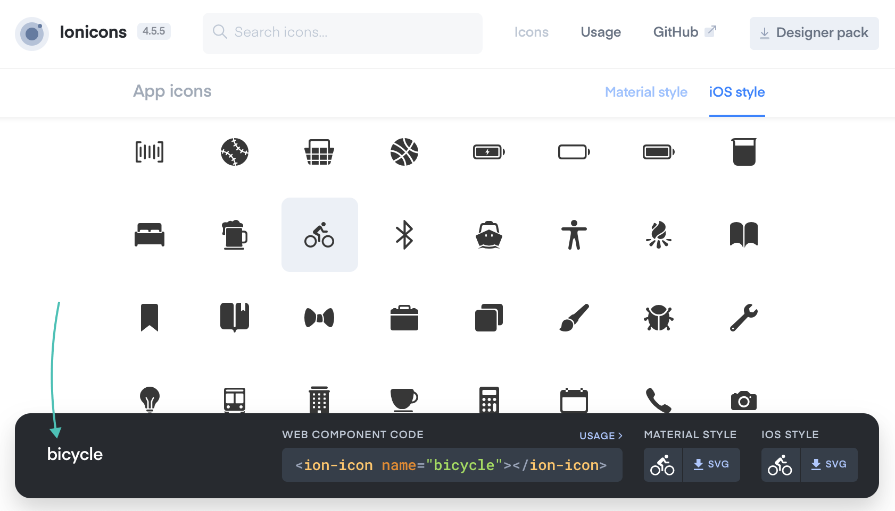

# Ionicons

There’s a number of ways to import icons into your prototypes. You can create an icon font, store icons as images online, import an existing pack of icons, etc. Each option has it advantages, and your choice may depend on your ecosystem, for example, if a client or a product has its own set of icons, that you are obliged to use. For most cases, however, using a publicly available icon pack is the quickest and the most convenient option.

[Ionicons](https://ionicons.com) is a free icon pack that comes with a Material and an iOS version of each icon. This article provides a simple usage guide, and the detailed instructions can be found on the [Usage](https://ionicons.com/usage) page of Ionicons’ website.

### Import

First, you need to import the icon set into your prototype. Create a new pen or open an existing one, and go to CSS settings by clicking the gear icon in the header of the CSS section. Paste this link into a list of external stylesheets/pens below the search:

```html
https://unpkg.com/ionicons@4.5.5/dist/css/ionicons.min.css
```

Save and close the settings. The icon set is now imported into your pen. 

### Find

The Ionicons [home page](https://ionicons.com) allows you to look around for a suitable icon by scrolling through the full list of icons, or by entering a search query. You can also switch between *Material style* and *iOS style* tabs to see different versions.

When you find an icon you want to use, click on it, and a toast bar should appear at the bottom. Copy the name of the icon from the left side of the bar:



### Use

Go to your prototype and create an empty `span` or a `div`. Add the `class` attribute to it with a value composed of three items:

```html
<div class="ion-md-bicycle"></div>
```

- `ion-` indicates that this is an Ionicon icon.
- `ios-` or `md-` indicates which style you want to use: iOS or Material design.
- The name of the icon you copied from the Ionic website.

You should be able to see the icon in the Preview:

<iframe height="247" style="width: 100%;" scrolling="no" title="Ionicons—init" src="//codepen.io/andgordy/embed/QRKExm/?height=247&theme-id=36403&default-tab=result" frameborder="no" allowtransparency="true" allowfullscreen="true">
  See the Pen <a href='https://codepen.io/andgordy/pen/QRKExm/'>Ionicons—init</a> by And Gordy
  (<a href='https://codepen.io/andgordy'>@andgordy</a>) on <a href='https://codepen.io'>CodePen</a>.
</iframe>

The Ionicons are imported as text, which means that you can stylize them with Tailwind’s text classes:

```html
<div class="ion-md-bicycle text-blue-500 text-5xl"></div>
```

<iframe height="244" style="width: 100%;" scrolling="no" title="Ionicons—stylized" src="//codepen.io/andgordy/embed/LoRZXV/?height=244&theme-id=36403&default-tab=result" frameborder="no" allowtransparency="true" allowfullscreen="true">
  See the Pen <a href='https://codepen.io/andgordy/pen/LoRZXV/'>Ionicons—stylized</a> by And Gordy
  (<a href='https://codepen.io/andgordy'>@andgordy</a>) on <a href='https://codepen.io'>CodePen</a>.
</iframe>

Notice that the icon is imported with a class name name only, and the container doesn’t have any content.

## Practice

### Tabs

<iframe height="238" style="width: 100%; margin-top: 24px;" scrolling="no" title="Ionicons—Task 1" src="//codepen.io/andgordy/embed/WBXXQZ/?height=238&theme-id=36403&default-tab=result" frameborder="no" allowtransparency="true" allowfullscreen="true">
  See the Pen <a href='https://codepen.io/andgordy/pen/WBXXQZ/'>Ionicons—Task 1</a> by And Gordy
  (<a href='https://codepen.io/andgordy'>@andgordy</a>) on <a href='https://codepen.io'>CodePen</a>.
</iframe>

1. Create a new pen.
2. Import Ionicons, as explained in the [Import section](#import) above. Import Tailwind as explained in the [previous article](./tailwind.md#importing).
3. Create five tabs using the flex container. Distribute the child containers evenly using the Tailwind’s `justify-around` class.
4. Create five child containers with Ionicons. Don’t forget to change the size and the color using text classes:

```html
<div class="ion-md-home text-2xl text-teal-500"></div>
```