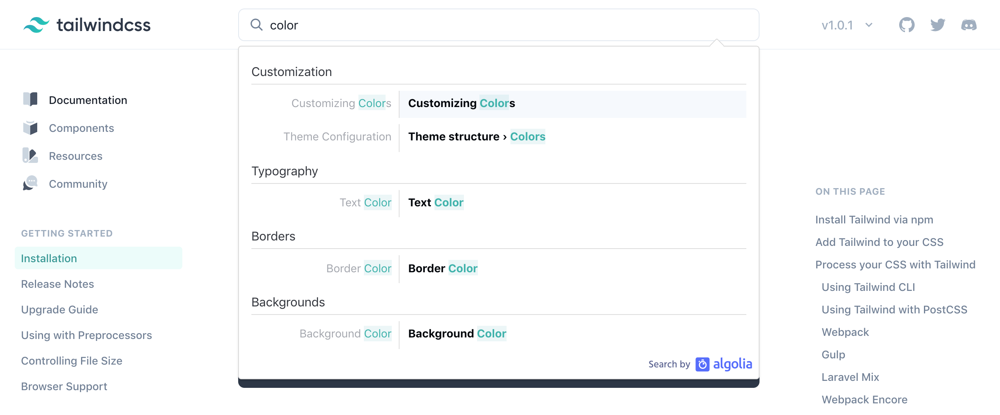
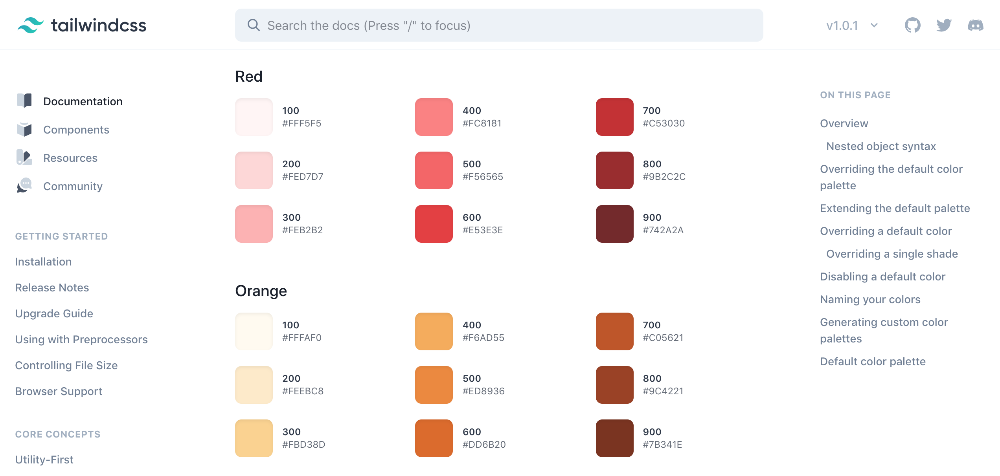

# Tailwind

## CSS frameworks

Writing inline styles is quite time-consuming. So is creating your own design systems using classes. Fortunately, a number of CSS frameworks exist to save you some time.

A CSS framework is essentially a CSS file with a lot of classes, accompanied by a website that explains where and how to use these classes. You import the file to a prototype, study the website, and instead of writing your own CSS, you use classes provided by the framework.

Most of the CSS frameworks are basically UI kits. They come packed with classes that turn your containers into fully-styled UI components like headers, cards, sidebars etc. You can save a lot of time with a framework of UI kit type. Just take a look at how many styles are applied when you add the `btn` class to a button in **Bootstrap**—the most popular UI kit framework:

```css
.btn {
  display: inline-block;
  font-weight: 400;
  color: #212529;
  text-align: center;
  vertical-align: middle;
  -webkit-user-select: none;
  -moz-user-select: none;
  -ms-user-select: none;
  user-select: none;
  background-color: transparent;
  border: 1px solid transparent;
  padding: .375rem .75rem;
  font-size: 1rem;
  line-height: 1.5;
  border-radius: .25rem;
  transition: color .15s ease-in-out,background-color .15s ease-in-out,border-color .15s ease-in-out,box-shadow .15s ease-in-out;
}
```

However, there’s one major downside to using UI kit frameworks for prototyping. By adopting a framework of this type you are limited to the way components and layouts are designed in the framework, whereas the prototyping workflow should inspire creativity, freedom to experiment and change things on the go. You always have an option to override the styles a framework provides, or even create your own classes on top of the existing ones. But this defeats the purpose of using frameworks, which is to save time by not writing CSS and not creating your own classes.

## Enter Tailwind

Tailwind is a CSS framework that takes a different approach. It provides you with a set of utility classes, which means that a class in Tailwind usually consists of a single CSS property with a specific value. Here are, for example, some flexbox styles that Tailwind has wrapped in classes:

```css
.flex {
  display: flex;
}
.flex-col {
  flex-direction: column;
}
.flex-row {
  flex-direction: row;
}
.items-center {
  align-items: center;
}
.items-start {
  align-items: flex-start;
}
.items-end {
  align-items: flex-end;
}
```

Using these classes is very similar to writing CSS in the `style` attribute. This allows you to create custom designs and layouts, write less code and still benefit from having a design system. You can learn more on how using Tailwind compares to using UI kit frameworks and inline styles in [Tailwind’s official docs](https://tailwindcss.com/docs/utility-first/).

### Demo

Creating a prototype often starts with designing the core layout. For example, you want to begin with a three-column layout with the third column broken down into three areas:

<iframe height="532" style="width: 100%;" scrolling="no" title="WBGLzL" src="//codepen.io/andgordy/embed/WBGLzL/?height=532&theme-id=36403&default-tab=result" frameborder="no" allowtransparency="true" allowfullscreen="true">
  See the Pen <a href='https://codepen.io/andgordy/pen/WBGLzL/'>WBGLzL</a> by And Gordy
  (<a href='https://codepen.io/andgordy'>@andgordy</a>) on <a href='https://codepen.io'>CodePen</a>.
</iframe>

Here’s what it takes to create this layout with Tailwind:

```html
<div class="flex h-screen">
  <!--COLUMN 1-->
  <div class="w-16 bg-teal-600"></div>
  <!--COLUMN 2-->
  <div class="w-56 bg-teal-500"></div>
  <!--COLUMN 3-->
  <div class="flex-1 flex flex-col">
    <div class="h-12 bg-teal-400"></div>
    <div class="flex-1 bg-teal-300"></div>
    <div class="h-12 bg-teal-400"></div>
  </div>
</div>
```

The properties that are required to build this layout are applied using classes, with takes much less code compared to inline styles:

- The main container is a full-screen flex container.
- The first two columns have fixed width.
- The third column is a `flex: 1` child, and it’s also a flex container with `flex-direction: column`, and so on.

## Using Tailwind

### Importing

First, you import Tailwind to your prototype by adding the link below to the list of external stylesheets, found in the CSS settings of your pen:

```html
https://cdn.jsdelivr.net/npm/tailwindcss@next/dist/tailwind.min.css
```

### Navigating the docs

It takes time to learn how Tailwind maps CSS properties to class names. The Tailwind’s website has two ways to navigate around the content: a search bar at the top, and the list of specifications on the left. The sidebar navigation is great and provides a nice overview of the framework’s structure, but you will probably find yourself using search most of the time. Often you have a CSS property in mind, and you need to find what classes Tailwind provides for it. And searching for it is usually faster than looking for it in the sidebar:



### **Color**

Tailwind comes with a [default palette of colors](https://tailwindcss.com/docs/customizing-colors/#default-color-palette) that are used by the framework for [text color](https://tailwindcss.com/docs/text-color), [background color](https://tailwindcss.com/docs/background-color) and [border color](https://tailwindcss.com/docs/border-color):



Here’s an example of the colors being part of the class names:

```html
<div class="text-teal-500"></div>              <!-- teal text -->
<div class="bg-pink-100"></div>                <!-- a very light pink background -->
<div class="border border-yellow-300"></div>   <!-- light yellow border -->
```

### **Restraints**

Tailwind is so much more than just a library of classes. You may find very exciting advanced features in Tailwind's documentation such as [configuration](https://tailwindcss.com/docs/configuration) that allows you to customize default classes and create your own, and the ability to add [new utilities](https://tailwindcss.com/docs/adding-new-utilities).

Unfortunately, those features are not available when importing Tailwind into a prototype on CodePen. However, you can still overwrite the Tailwind classes and create your own by adding them to the CSS section.

## **Practice**

Throughout the course, you learned CSS properties and practiced applying them inline with the use of the `style` attribute. Working with Tailwind is a very similar process, but instead of applying CSS properties, you use Tailwind classes in the `class` attribute.

To get used to a new way of applying styles, try completing the tasks from the previous articles by importing Tailwind and using its classes for styling. Below are a couple of examples for you to review and to get a better understanding of what styling with Tailwind looks like.

### Tabs

<iframe height="237" style="width: 100%; margin-top: 24px;" scrolling="no" title="Flex—Alignment—Task 2, Tailwind" src="//codepen.io/andgordy/embed/PvOjmm/?height=237&theme-id=36403&default-tab=result" frameborder="no" allowtransparency="true" allowfullscreen="true">
  See the Pen <a href='https://codepen.io/andgordy/pen/PvOjmm/'>Flex—Alignment—Task 2, Tailwind</a> by And Gordy
  (<a href='https://codepen.io/andgordy'>@andgordy</a>) on <a href='https://codepen.io'>CodePen</a>.
</iframe>

```html
<div class="flex justify-around bg-white border-b border-gray-400">
  <div class="p-4 text-teal-500 border-b-4 border-teal-500">
    Tab 1
  </div>
  <div class="p-4">
    Tab 2
  </div>
  <div class="p-4">
    Tab 3
  </div>
</div>
```

### Recent

<iframe height="374" style="width: 100%; margin-top: 24px;" scrolling="no" title="Flex—overflow—Task 2, Tailwind" src="//codepen.io/andgordy/embed/EzbwQR/?height=374&theme-id=36403&default-tab=result" frameborder="no" allowtransparency="true" allowfullscreen="true">
  See the Pen <a href='https://codepen.io/andgordy/pen/EzbwQR/'>Flex—overflow—Task 2, Tailwind</a> by And Gordy
  (<a href='https://codepen.io/andgordy'>@andgordy</a>) on <a href='https://codepen.io'>CodePen</a>.
</iframe>

```html
<div class="flex justify-center">
  <div class="w-full max-w-lg pt-4">
    <!-- Card 1 -->
    <div class="flex items-center p-2">
      <div class="w-16 h-16 rounded-full mr-3 overflow-hidden flex items-center">
        
      </div>
      <div class="flex-1">
        <div class="flex items-center">
          <div class="font-semibold text-lg text-teal-500">Joe Cole</div>
          <div class="flex-1"></div>
          <div class="text-sm text-gray-600">12:15 AM</div>
        </div>
        <div>Have they heard of Klimt anyway?</div>
      </div>
    </div>
    <!-- Card 2 -->
    ...
  </div>
</div>
```

### Article

<iframe height="464" style="width: 100%; margin-top: 24px;" scrolling="no" title="Flex—overflow—Task 1.1, Tailwind" src="//codepen.io/andgordy/embed/pmdWqd/?height=464&theme-id=36403&default-tab=result" frameborder="no" allowtransparency="true" allowfullscreen="true">
  See the Pen <a href='https://codepen.io/andgordy/pen/pmdWqd/'>Flex—overflow—Task 1.1, Tailwind</a> by And Gordy
  (<a href='https://codepen.io/andgordy'>@andgordy</a>) on <a href='https://codepen.io'>CodePen</a>.
</iframe>

```html
<div class="flex flex-col h-screen antialiased">
  <!-- Header -->
  <div class="flex py-4 px-3 items-center border-b border-gray-300">
    <div class="flex-1">
      <button class="px-2 text-gray-600">Home</button>
      <button class="px-2 text-gray-600">Categories</button>
    </div>
    <div class="font-serif text-2xl">Hours Magazine</div>
    <div class="flex-1 text-right">
      <button class="px-2 text-gray-600">Search</button>
      <button class="px-2 text-gray-600">Login</button>
      <button class="px-2 text-gray-600">Sign up</button>
    </div>
  </div>
  <!-- Article -->
  <div class="flex-1 overflow-scroll flex justify-center">
    <div class="w-full max-w-xl">
      <div class="text-3xl font-bold text-center pt-6">
        Everything architecture
      </div>
      <div class="text-gray-500 text-center font-serif pb-3">
        by Steve Allen, May 20 2019
      </div>
      <div class="text-lg py-2 px-4">
        Vernacular architecture ...
      </div>
      <div class="font-serif py-2 px-4">
        One such reaction to ...
      </div>
      <div class="font-serif py-2 px-4">
        Business architecture ...
      </div>
    </div>
  </div>
</div>
```