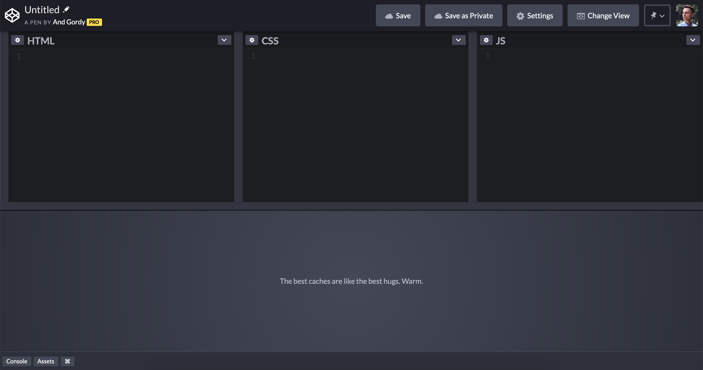
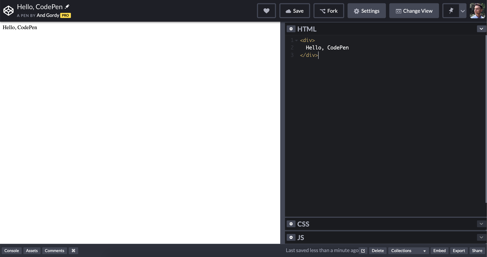

# CodePen

Generally, there are two types of environments for working with HTML and CSS: you can either create and preview files locally on your computer, or use an online tool. The second approach is more suitable for this course for a number of reasons:

- You code and see the results immediately in the same browser window.
- You can easily share your results.
- You can study and duplicate the prototypes shared by other designers.

The Layout basics and the [Interaction basics](https://mockupless.com/Courses/InteractionBasics/) courses use [CodePen](https://codepen.io) for embedded examples and tasks. We highly recommend you this tool, because it has everything you need for basic prototyping, and it’s also a nice social platform for creative people to share their work and find inspiration.

## Create

When you create an account, the *Create* menu becomes available to you in the left sidebar. To create a new prototype, select *Pen* from this menu. You should be presented with the Pen UI then:

You have three sections for your code: HTML, CSS and JS. Below is the Preview area, that starts showing your prototype as soon as you have some code entered. The preview is updated automatically when you make changes to the code.

You can change the layout in the *Change View* menu in the top right. You can also expand and collapse code panels by double-clicking on their headers: 

All Pens that you create or fork, are available in the *Dashboard*, found in the left sidebar on CodePen’s homepage.

## Fork

You can duplicate any prototype on CodePen. This includes your own pens and the ones created by other people. To duplicate a pen, click the *Fork* button in the top right. Forking has two important applications:

- When creating a prototype, you often decide to try a couple of options. Forking is a convenient way of creating alternative versions of a prototype, that allows you to test multiple options.
- When viewing a prototype created by someone else, you may want to play with it by making some changes to its code, or even use it to start your own project. Forking someone else’s prototype creates a copy for you, and allows you to edit its code. Some tasks in this course encourage you to fork an existing pen—a starting prototype created specifically for the task, or a prototype you created for a previous task—so you don’t have to start from scratch.