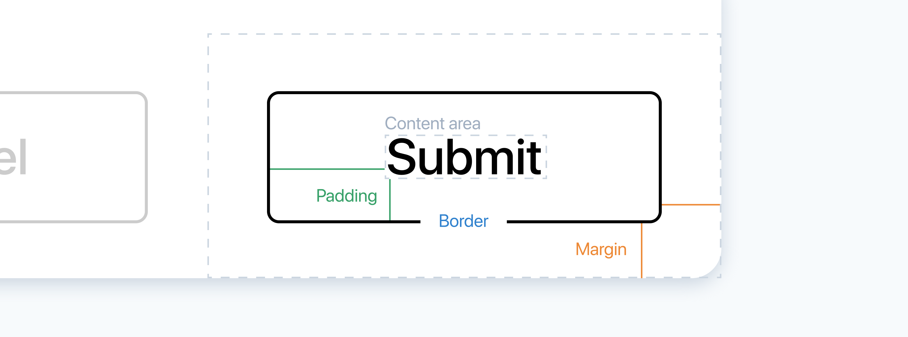

# Box model 

Every container is a box that consists of content area, padding, borders and margins:



- **Content area** is where text and images appear.
- **Padding** is the inner space between content area and border.
- **Border** is the line between padding and margin created with the `border` property.
- **Margin** is the outer space between border and another container.

## Padding

Padding is the space around the content area. The padding area is filled with background (if a container has one) and it responds to interactions like hover and click. Paddings can be specified with four properties:

```html
<button style="padding-top: 8px;
               padding-bottom: 8px;
               padding-right: 32px;
               padding-left: 32px;">
  Click
</button>
```

The code above creates vertical and horizontal space between “Submit” and the border:

<iframe height="221" style="width: 100%;" scrolling="no" title="Box model—Padding" src="//codepen.io/andgordy/embed/WBNMaV/?height=221&theme-id=36403&default-tab=result" frameborder="no" allowtransparency="true" allowfullscreen="true">
  See the Pen <a href='https://codepen.io/andgordy/pen/WBNMaV/'>Box model—Padding</a> by And Gordy
  (<a href='https://codepen.io/andgordy'>@andgordy</a>) on <a href='https://codepen.io'>CodePen</a>.
</iframe>

There’s also a shorthand property, `padding`, that allows you to specify values for all sides together:

```html
<button style="padding: 32px 8px 32px 8px;">
  Click
</button>
```

The order is clockwise starting with top: `top`, `right`, `bottom`, `left`.

If the vertical and horizontal values are the same, as in the example above, you can shorten the style further:

```html
<button style="padding: 32px 8px;">
  Click
</button>
```

First value specifies the top and the bottom paddings, and the second value specifies the right and the left ones.

If you need the same paddings on all sides of a container, you can enter a single value:

```html
<button style="padding: 12px;">
  Click
</button>
```

## Margin

Margin is the space between the container’s border and another container. The margin area is not filled with background even if a container has one, and it does not respond to interactions like hover or click.

The `margin` property has the same system of shorthand values as `padding`:

```css
/* separate properties */
margin-top: 2px;
margin-bottom: 2px;
margin-left: 8px;
margin-right: 8px;

/* shorthand property */
margin: 2px 8px 2px 8px;

/* vertical and horizontal values */
margin: 2px 8px;

/* one value for all sides */
margin: 12px;
```

The margin is used, for example, to create space between two elements with borders or backgrounds:

<iframe height="220" style="width: 100%;" scrolling="no" title="Box model—Margin" src="//codepen.io/andgordy/embed/BeaYbe/?height=220&theme-id=36403&default-tab=result" frameborder="no" allowtransparency="true" allowfullscreen="true">
  See the Pen <a href='https://codepen.io/andgordy/pen/BeaYbe/'>Box model—Margin</a> by And Gordy
  (<a href='https://codepen.io/andgordy'>@andgordy</a>) on <a href='https://codepen.io'>CodePen</a>.
</iframe>

Some tags in html, including `body`, have default margins. If you you want, for example, a container to take full width of the page with `width: 100vw`, you need to go to the CSS section and reset margins of the `body` tag to `0`:

```css
body {
  margin: 0;
}
```

## Width and height

The `width` and the `height` properties allow you to specify the size of a container:

```html
<div style="width: 200px;
            height: 200px;
            padding: 24px;
            background-color: #eee">
</div>
```

<iframe height="392" style="width: 100%;" scrolling="no" title="Box model—Width and height" src="//codepen.io/andgordy/embed/dEydBK/?height=392&theme-id=36403&default-tab=result" frameborder="no" allowtransparency="true" allowfullscreen="true">
  See the Pen <a href='https://codepen.io/andgordy/pen/dEydBK/'>Box model—Width and height</a> by And Gordy
  (<a href='https://codepen.io/andgordy'>@andgordy</a>) on <a href='https://codepen.io'>CodePen</a>.
</iframe>

By default, `width` and `height` specify width and height of the **content area only**. Even though the `width` *property* of the container above is set to 200px, its *actual* width is 248 pixels, because two paddings—24 pixels each—are added to the sides.

A special property, `box-sizing`, allows you to avoid all those complex calculation. When you add `box-sizing: border-box;` to a container, whatever you specify in the `width` property will become the actual width of the container. With this style, the size of the border and the paddings will be included in `width`:

```html {6}
<div style="width: 200px;
            height: 200px;
            padding: 24px;">
  <!-- content -->
</div>
<div style="box-sizing: border-box;
            width: 200px;
            height: 200px;
            padding: 24px;">
  <!-- content -->
</div>
```

<iframe height="474" style="width: 100%;" scrolling="no" title="Box model—Width and height, border-box" src="//codepen.io/andgordy/embed/mYdXNa/?height=474&theme-id=36403&default-tab=result" frameborder="no" allowtransparency="true" allowfullscreen="true">
  See the Pen <a href='https://codepen.io/andgordy/pen/mYdXNa/'>Box model—Width and height, border-box</a> by And Gordy
  (<a href='https://codepen.io/andgordy'>@andgordy</a>) on <a href='https://codepen.io'>CodePen</a>.
</iframe>

You can also add this style to body and the universal selector, so widths and heights are calculated the easy way for all elements in your prototype:

```css
body, * {
  box-sizing: border-box;
}
```

## max-width and max-height

Sometimes you need to define width using relative values, like `%` or `vw`, so a container adjusts to the width of the screen. For example, you create a container that takes the full width of its parent:

```html
<div style="width: 100%;">
  Lorem ipsum dolor sit amet consectetur...
</div>
```

<iframe height="225" style="width: 100%;" scrolling="no" title="Box model—max-width, 1" src="//codepen.io/andgordy/embed/NVNjMj/?height=225&theme-id=36403&default-tab=result" frameborder="no" allowtransparency="true" allowfullscreen="true">
  See the Pen <a href='https://codepen.io/andgordy/pen/NVNjMj/'>Box model—max-width, 1</a> by And Gordy
  (<a href='https://codepen.io/andgordy'>@andgordy</a>) on <a href='https://codepen.io'>CodePen</a>.
</iframe>

This layout works fine for smaller and medium-sized screens, but on bigger screens you run into a risk of making the text hard to read, because the lines become too wide. To prevent the container from expanding beyond a particular size, you can use the `max-width` property:

```html
<div style="width: 100%;
            max-width: 540px;">
  Lorem ipsum dolor sit amet consectetur...
</div>
```

<iframe height="234" style="width: 100%;" scrolling="no" title="Box model—max-width, 2" src="//codepen.io/andgordy/embed/oRxWav/?height=234&theme-id=36403&default-tab=result" frameborder="no" allowtransparency="true" allowfullscreen="true">
  See the Pen <a href='https://codepen.io/andgordy/pen/oRxWav/'>Box model—max-width, 2</a> by And Gordy
  (<a href='https://codepen.io/andgordy'>@andgordy</a>) on <a href='https://codepen.io'>CodePen</a>.
</iframe>

If you [open this prototype](https://codepen.io/andgordy/pen/oRxWav?editors=1000) in a new tab and resize the preview panel, you will see that the text takes the full width on smaller window sizes, but stops at a certain width on larger sizes.

Similarly, `max-height` defines the maximum vertical size of a container, but this property is not used too often.

## Practice

### Texts

Add paddings to the article prototype to improve vertical rhythm:

<iframe height="536" style="width: 100%;" scrolling="no" title="Box model—Task 1" src="//codepen.io/andgordy/embed/gJGgLx/?height=536&theme-id=36403&default-tab=result" frameborder="no" allowtransparency="true" allowfullscreen="true">
  See the Pen <a href='https://codepen.io/andgordy/pen/gJGgLx/'>Box model—Task 1</a> by And Gordy
  (<a href='https://codepen.io/andgordy'>@andgordy</a>) on <a href='https://codepen.io'>CodePen</a>.
</iframe>

1. For your result of task in the [Text styles article](./../Style/text.md#practice). You can also fork the [prototype from the article](https://codepen.io/andgordy/pen/GavVrP).
2. Add vertical paddings to all containers. You can either use the shorthand property `padding`, or use side-specific value like `padding-top` and `padding-bottom`.
3. Add horizontal paddings to paragraphs too.

Note, that the prototype you forked may have a default padding set for `div` containers in the CSS section. You can delete those styles if you don’t want to overwrite them.

When you’re done with this task, fork your result of the task in the [Opacity and shadow article](./../Style/opacity-and-shadow.md#practice) and improve the layout of the card using padding similarly to the way you did this for the article design above.

### Buttons

Create a set of buttons using the `button` tag:

<iframe height="199" style="width: 100%;" scrolling="no" title="Box model—Task 2" src="//codepen.io/andgordy/embed/YbrNOx/?height=199&theme-id=36403&default-tab=result" frameborder="no" allowtransparency="true" allowfullscreen="true">
  See the Pen <a href='https://codepen.io/andgordy/pen/YbrNOx/'>Box model—Task 2</a> by And Gordy
  (<a href='https://codepen.io/andgordy'>@andgordy</a>) on <a href='https://codepen.io'>CodePen</a>.
</iframe>

1. Fork the [starting prototype](https://codepen.io/andgordy/pen/VOMPJr?editors=1000).
2. The `button` tag comes with a lot of styles, like `font-size`, `background-color` and others. To create custom designs you will need to overwrite most of them.
3. Try designing buttons using `width` and `height`, and alternatively using `padding` instead. Using paddings is considered to be a more universal approach, but you are free to pick the one you think works best for you.
4. Use margins to create space between buttons.
5. When designing the Ghost and the Pill buttons, notice that they appear 2 pixels higher than, for example, the Primary button even when you apply the same vertical paddings. That is because the border adds pixels to the height of the button. You can either add borders of the same color as the background to the Primary, the Secondary and the Alert buttons, or use smaller vertical paddings in the Ghost and the Pill buttons.

### Wireframe

Create a wireframe of a layout with a header and a sidebar.

<iframe height="561" style="width: 100%;" scrolling="no" title="Box model—Task 3" src="//codepen.io/andgordy/embed/WBZpxV/?height=561&theme-id=36403&default-tab=result" frameborder="no" allowtransparency="true" allowfullscreen="true">
  See the Pen <a href='https://codepen.io/andgordy/pen/WBZpxV/'>Box model—Task 3</a> by And Gordy
  (<a href='https://codepen.io/andgordy'>@andgordy</a>) on <a href='https://codepen.io'>CodePen</a>.
</iframe>

1. Create a container with `height` set to 10vh and a bottom border.
2. Create another container with the fixed width, `height` set to 90vh, and a right border.
3. As described in this article, in the [Margin section](#margin), you need to set the `margin` property of the `body` tag to 0 in the CSS section. Without this, the scrolling will appear, because the total height of the prototype will be 10vh + 90vh + body’s margins. And if the total height is more than 100vh, the scrollbar appears.
4. As described in this article, in the [Width and height section](#width-and-height), you also need to set the `box-sizing` property to `border-box` in the CSS section. Without this the scrolling with appear, because the total height of the prototype will be 10vh + 90vh + border width. Once again, if the total height is more than 100vh, the scrollbar appears.