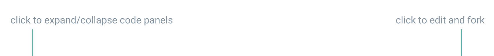

# Practice

Most articles in this course have tasks so that you can practice new material. Completing them is optional but it’s also highly recommended. Even the easiest concepts are worth spending some time to practice, so basic skills don’t let you down when you work on complex prototypes.

Each task comes with a complete prototype. If you struggle with a task or if you want to compare your prototype’s code to the one from an article, you can view the code of the completed prototype by expanding the *HTML* and the *CSS* panels. You can also view the prototype in full screen mode, edit it and fork it by pressing *Edit on CodePen* on the top right:

<iframe height="230" style="width: 100%; margin-top:-24px;" scrolling="no" title="Interaction basics—Practice" src="//codepen.io/andgordy/embed/EJbrMW/?height=231&theme-id=36403&default-tab=result" frameborder="no" allowtransparency="true" allowfullscreen="true">
  See the Pen <a href='https://codepen.io/andgordy/pen/EJbrMW/'>Interaction basics—Practice</a> by And Gordy
  (<a href='https://codepen.io/andgordy'>@andgordy</a>) on <a href='https://codepen.io'>CodePen</a>.
</iframe>

Trying to apply newly obtained knowledge can be challenging sometimes. Remember, you’re not alone on your journey. Feel free to ask for help, share your progress, and assist others on the [Layout basics forum](https://spectrum.chat/mockupless/layout-basics).