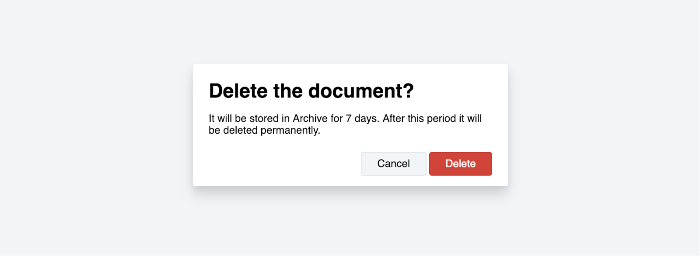

# Practice

## Task #1

Create a layout for a basic confirmation dialog view using Tailwind classes. 

[Tailwind documentation](https://tailwindcss.com/docs/what-is-tailwind) | [Complete file](./../../../course-files/layout-basics/tailwind-task-1.html.zip)

## Task #2

Create a copy of the dialog view you created for task #1 and apply changes to give it iOS-like view:

[Tailwind documentation](https://tailwindcss.com/docs/what-is-tailwind) | [Complete file](./../../../course-files/layout-basics/tailwind-task-2.html.zip)