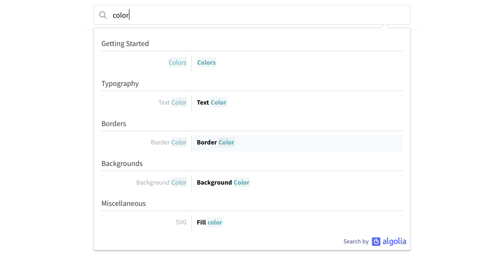

# Usage

## Install

To be able to use Tailwind in your prototypes you just need to include a link to Tailwind's stylesheet in your `<head>` container:

```html
<head>
  <!-- prototype meta  -->
  <link href="https://cdn.jsdelivr.net/npm/tailwindcss/dist/tailwind.min.css" rel="stylesheet">
</head>
```

With this line in place you are able to apply Tailwind classes to your prototype:

```html
<button class="px-6 py-3 rounded text-white bg-teal hover:bg-teal-dark">
  Confirm
</button>
```


## Use

It takes time to learn Tailwind names of CSS properties. In the course's following articles you will become familiar with the way Tailwind works with CSS you've learnt so far. However, the most complete and up-to-date reference is [Tailwind's official documentation](https://tailwindcss.com/docs/what-is-tailwind). Its navigation on the left has a very nice structure, but you will probably find yourself using search most of the time, because it's way faster to navigate with it:



## Restraints

Tailwind is so much more than just a library of classes <!--, but that's what our way of using it is limited too-->. You may find very exiting advanced features in Tailwind's documentation such as [configuration](https://tailwindcss.com/docs/configuration) that allows you to customize default classes and create your own, and the ability to add [new utilities](https://tailwindcss.com/docs/adding-new-utilities).

Unfortunally, those are not avalailable when using Tailwind in flat html file. However you can still overwrite the Tailwind classes and create your own by writing them in `<style>` container inside the `<head>` of your prototype:

```html
<head>
  <!-- prototype meta  -->
  <link href="https://cdn.jsdelivr.net/npm/tailwindcss/dist/tailwind.min.css" rel="stylesheet">
  <style>
    .px-4 {
      padding-left: 1.1rem;
      padding-right: 1.1rem;
    }
  </style>
</head>
```

You have to make sure though, that your `<style>` container is below Tailwind's `<link>`, so it has higher priority.