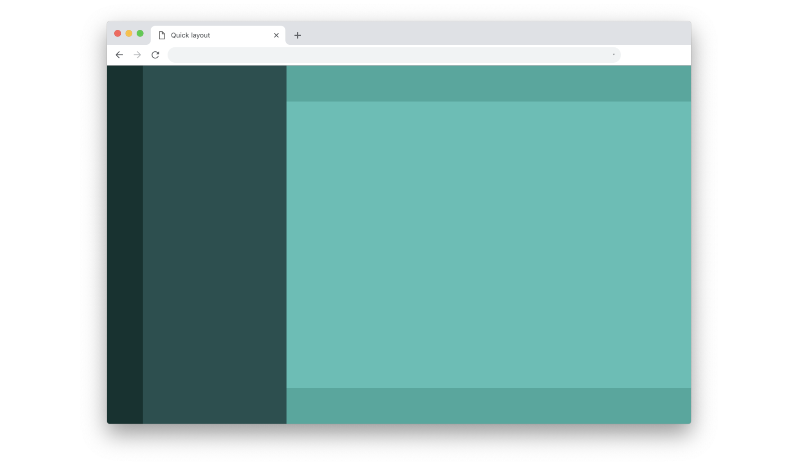

# What's Tailwind

As [official documentation](https://tailwindcss.com/docs/what-is-tailwind) puts it: Tailwind is a utility-first CSS framework for rapidly building custom user interfaces. Let's clarify some particularly important parts of this definition.

#### CSS framework
Tailwind is a stylesheet with a bunch of classes someone created for you. This means you need less time and less code compared to creating your own classes and writing plain CSS.

#### Utility-first
Tailwind doesn't have abstract component classes like `button`, `sidebar` or `column`. As a result you are not bound to look and behaviour of any UI kit, so you design freely.

### In a nutshell

Tailwind's classes usually have one, rarely two or more CSS properties wrapped in a short, yet readable name. As a result, the process is very similar to writing styles on the go, but instead you write classes:

```html
<div class="flex flex-col items-center">
```

With Tailwind in place, the container above becomes flex container, receives vertical direction and center-aligns its children horizontally. Here're Tailwind classes used by this layout:

```css
.flex {
  display: flex;
}
.flex-col {
  flex-direction: column;
}
.items-center {
  align-items: center;
}
```

## Demo

Often prototyping starts with layout, so you want to quickly put your containers and styles in place to start creating full-screen multi-column layout:



Here's what it takes to create it using Tailwind:

```html
<div class="flex h-screen">
  <div class="w-16 bg-teal-darkest"></div>
  <div class="w-64 bg-teal-darker"></div>
  <div class="flex-1 flex flex-col">
    <div class="h-16 bg-teal-dark"></div>
    <div class="flex-1 bg-teal"></div>
    <div class="h-16 bg-teal-dark"></div>
  </div>
</div>
```

## Comparison

### CSS styles

```html
<!-- Tailwind -->
<div class="flex-1 flex flex-col">

<!-- CSS styles -->
<div style="flex: 1; display: flex; flex-direction: column;">
```
CSS styles require more code - it's more time-consuming. It also plain CSS, so it requires syntax and every missed colon or mis-typed semicolon will lead to errors.

### CSS classes
```html
<!-- Tailwind --> 
<div class="flex-1 flex flex-col">

<!-- CSS classes -->
<div class="main-content-container">
<style>
  .main-content-container {
    flex: 1;
    display: flex;
    flex-direction: column;
  }
</style>
```
When creating classes you still have to write plain CSS, writing more code and caring about syntax. Implementing changes also takes more time with classes, since you will have to constantly navigate between html and css parts of your code.

Also component-based class is an abstraction, which brings an unnecessary complexity to the prototyping process. Component-based classes work best when you have approved design and a design system in place, but when every container is a subject to change by design, Tailwind allows you to quickly design custom components and apply fixes to them on the fly. To put it short: **transforming layouts and components is way faster with Tailwind, and it's a very important feature for a workflow that implies constant change**.

### UI kit frameworks
```html
<!-- Tailwind --> 
<div class="flex-1 flex flex-col">

<!-- Bootstrap -->
🤷🏾‍♂️
```
Bootstrap's layout has a couple of [basic concepts](https://getbootstrap.com/docs/4.1/layout/overview/) on how a layout can be built and a full-screen view with header, scrollable content area and footer is not among them. This doesn't it cannot be achieved with Bootstrap, but this is a good example because the amount of abstractions you need to know and use to implement and maintain it is beyond the concept of rapid prototyping.
<!-- todo: show bootstrap code, explain more why abstrations are no good for prototyping, soften the language maybe -->