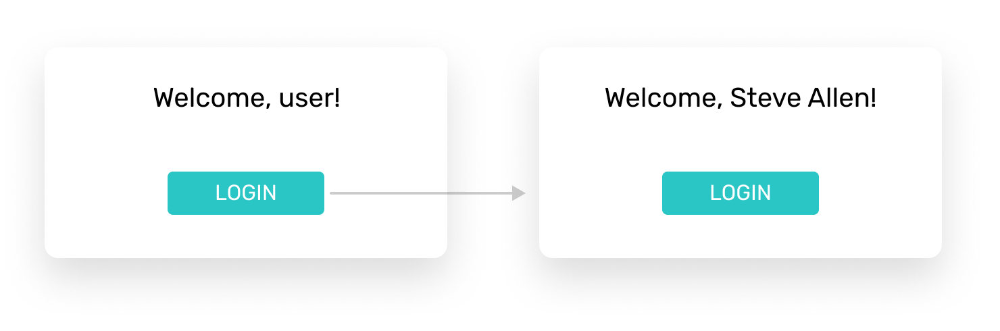

# Listen to actions and react

## The task

In [Store and display data](./storeAndRead.md) you've created a variable to store number of items in a shopping cart and displayed its value in your layout. Your next task is to increase this number each time a user presses Purchase button:


To make this happen you need to do two things:
1. Make a button react to clicks — this is called adding a [listener](#listener) to an element
2. Create a set of instructions to be executed when click happens — they are called [functions](#functions)

## Listener

Click is called an **event**. Event is something that happens on the page, quite often due to a user’s action.

To make an element on a page listens to an event, you need to specify what event you want it to listen to and what’s the name of the function you want to be executed:

```vue
<button @click="addToCart()">Purchase</button>
```
- `@click` is an event we want our UI to react to
- `addToCart()` is the name of a function we want to be executed
- You can add a listener to virtually any container like div and span

## Functions

Function is a named container for your instructions:

```js
addToCart () {
  this.itemsInCart++
}
```
- `addToCart` is the name of a function
- `this.itemsInCart++` is the instruction — your way to describe what is supposed to happen.
- functions are placed in `methods: { }` part of vue code
- instruction can be quite complex, consist of multiple lines of code
Multiple types of instructions and ways to write them will be explore further in the course. This paritcular one adds 1 to an existing value of the variable.

## Task solution

```vue{26,39-41}
<!DOCTYPE html>
<html lang="en">
<head>
  <meta charset="UTF-8">
  <meta name="viewport" content="width=device-width, initial-scale=1.0">
  <meta http-equiv="X-UA-Compatible" content="ie=edge">
  <title>Goods Inc</title>
  <script src="https://cdn.jsdelivr.net/npm/vue/dist/vue.js"></script>
  <link href="https://fonts.googleapis.com/css?family=Rubik:400,500,700" rel="stylesheet">
</head>
<body style="margin: 0; font-family: Rubik;">
  <div id="app">
    <div style="display: flex; padding: 12px 24px; border-bottom: 1px solid #CCC;">
      <div style="flex: 1;"></div>
      <div style="width: 40px; height: 40px; background-color: #2AC5C5; font-size: 18px; font-weight: semibold; color: white; border-radius: 50%; display: flex; align-items: center; justify-content: center;">
        <div>{{itemsInCart}}</div>
      </div>
    </div>
    <div style="display: flex; justify-content: center;">
      <div style="width: 100%; max-width: 400px; display: flex; padding-top: 40px;">
        <div style="width: 160px; height: 240px; margin-right: 30px; background-color: #ec8ea7;"></div>
        <div style="flex: 1;">
          <div style="font-size: 24px;">Amazing good</div>
          <div style="color: grey; padding-top: 16px;">reasonable price</div>
          <div style="padding-top: 16px;">
            <button @click="addToCart()" style="background-color: #2AC5C5; border: none; padding: 12px 16px; color: white; font-size: 14px; border-radius: 2px;">Purchase</button></div>
        </div>
      </div>
    </div>
  </div>
</body>
<script>
  var app = new Vue({
    el: '#app',
    data: {
      itemsInCart: 2
    },
    methods: {
      addToCart () {
        this.itemsInCart++
      }
    }
  })
</script>
</html>
```
[Open on JSFiddle](https://jsfiddle.net/andgordy/xyw5n4vu/)

## Self-practice

Update the design of your welcome card from [Store and display self-practice](./storeAndRead.html#task-solution) to display **'user'** by default and change to this value to **'Steve Allen'** when a user clicks on **Login** button.



* the instruction of assigning a different value to a variable in a function is `this.nameOfYourVariable = 'New Value'`. You have to replace `nameOfYourVariable` with the actual name of the variable you are changing, and replace `'New Value'` with the value you want to assign to it.


<!-- ARCHIVE AND MISC BELOW -->

<!--Later you will learn other events, like hovering a container and pressing keyboard keys inside-->

<!-- ## Listen & Write

Also, this value is not static. For example, it increases when a user clicks on “Purchase” on an item page. To change the data you need to apply different value to the variable. To make it possible you need to do two things:
1. Create a set of instructions describing what should happen to variable. These set are called **methods**.
2. Track clicks on a button so you can launch set of instructions. **Listeners** are responsible for tracking events. -->