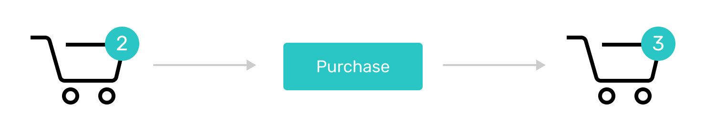

# Listen to actions and react

<!-- ## Listen & Write

Also, this value is not static. For example, it increases when a user clicks on “Purchase” on an item page. To change the data you need to apply different value to the variable. To make it possible you need to do two things:
1. Create a set of instructions describing what should happen to variable. These set are called **methods**.
2. Track clicks on a button so you can launch set of instructions. **Listeners** are responsible for tracking events. -->

## The task

::: warning 🙇‍
write a description of the task
:::



## Listen

Also, this value is not static — it increases when a user clicks on “Purchase” on an item page. For this to happen you need to be able to track clicks on a button. It's also called **listening** to events on a page:

<!--  -->
```vue
<button @click="addToCart()">Purchase</button>
```
* **@click** indicates what event we want to react to. It can be a click/tap, a hover, an input, etc.
* **addToCart()** is a call of a method, a set of instructions we want to be executed when the event takes place. 

## React

At some point of time, you might want to increase the number. A set of instructions describing what should happen to variable is called **methods**.

<!--  -->
```js
addToCart () {
  this.itemsInCart++
}
```
- **addToCart** is the name of a method
- **this.itemsInCart++** is the instruction — your way of describing of what is supposed to happen 

## Final result

```vue{26,39-41}
<!DOCTYPE html>
<html lang="en">
<head>
  <meta charset="UTF-8">
  <meta name="viewport" content="width=device-width, initial-scale=1.0">
  <meta http-equiv="X-UA-Compatible" content="ie=edge">
  <title>Goods Inc</title>
  <script src="https://cdn.jsdelivr.net/npm/vue/dist/vue.js"></script>
  <link href="https://fonts.googleapis.com/css?family=Rubik:400,500,700" rel="stylesheet">
</head>
<body style="margin: 0; font-family: Rubik;">
  <div id="app">
    <div style="display: flex; padding: 12px 24px; border-bottom: 1px solid #CCC;">
      <div style="flex: 1;"></div>
      <div style="width: 40px; height: 40px; background-color: #2AC5C5; font-size: 18px; font-weight: semibold; color: white; border-radius: 50%; display: flex; align-items: center; justify-content: center;">
        <div>{{itemsInCart}}</div>
      </div>
    </div>
    <div style="display: flex; justify-content: center;">
      <div style="width: 100%; max-width: 400px; display: flex; padding-top: 40px;">
        <div style="width: 160px; height: 240px; margin-right: 30px; background-color: #ec8ea7;"></div>
        <div style="flex: 1;">
          <div style="font-size: 24px;">Amazing good</div>
          <div style="color: grey; padding-top: 16px;">reasonable price</div>
          <div style="padding-top: 16px;">
            <button @click="addToCart()" style="background-color: #2AC5C5; border: none; padding: 12px 16px; color: white; font-size: 14px; border-radius: 2px;">Purchase</button></div>
        </div>
      </div>
    </div>
  </div>
</body>
<script>
  var app = new Vue({
    el: '#app',
    data: {
      itemsInCart: 2
    },
    methods: {
      addToCart () {
        this.itemsInCart++
      }
    }
  })
</script>
</html>
```
[Open on JSFiddle](https://jsfiddle.net/andgordy/xyw5n4vu/)

## Self-practice

::: warning 🙇‍
create a self-practice task
:::